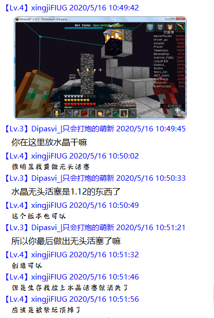

# 从源码角度解析 Minecraft 龙战运作机制（一）\~（五）

*本文使用的是 1.16.1 原版反编译得到的代码*

## 一、从屠龙炮开始

屠龙炮利用了一个特性，即游戏检查是否满足末影龙复活条件仅在玩家放下水晶时执行，无论玩家放下的水晶是否在祭坛上。视频中 Fallen_Breath 通过活塞推动末影水晶创造了复活龙的条件，此时因为没有执行检测，末影龙没有复活，直到有水晶被玩家放置。

 
控制复活条件检查的代码被写在 `minecraft\world\item\EndCrystalItem.java` 中，如下图。
 

在玩家拿着末影水晶右键时游戏检查当前状态是否满足末影水晶的放置条件，即选择的方块是否是黑曜石或者基岩、上方是否有方块或者实体阻挡。在放置判定成功之后，游戏创建末影水晶实体，然后进行龙的复活条件判定（`tryRespawn` 方法）。

## 二、末影龙复活条件判断的具体过程

注意到判断复活条件调用的是 `EndDragonFight` 的实例 `var14` 的 `tryRespawn` 方法，于是前往 `EndDragonFight` 类查看，代码如下：

现在仅讨论 `ArryList var7 = Lists.newArrayList()` 前的内容。这段嵌套 if 语句对龙巢（也就是返回传送门）的存在情况作了 3 种分类处理：

1.	level.dat 中记录了龙巢的位置——直接用该位置作为龙巢位置；
2.	level.dat 未记录龙巢位置，但是能找到龙巢样子的结构——用这个结构的“特定位置”的方块作为龙巢位置，并记入 level.dat；
3.	level.dat 未记录龙巢位置，也不能找到龙巢样子的结构——直接生成一个龙巢。

现在对三种处理的详细运行机制作进一步说明

### (1)	level.dat记录的龙巢位置

龙巢位置存储在 `Data.DragonFight.ExitPortalLocation`，尽管 1.9 以后龙巢位置 xz 值必然处于（0，0），但是这里仍然记录有 xyz 三个坐标。这意味着玩家可以通过修改 level.dat 自定义龙巢位置。

另外在此说明，level.dat 中的数据是在存档被读取的时候被读入内存中，后面提及的检查 level.dat 中某数据和向 level.dat 中写入数据只是为了表达方便，实际上程序并没有每次操作都访问一次文件。

### (2)	寻找龙巢样子的结构的机制

寻找龙巢结构调用的是 `findExitPortal` 方法，该方法代码如下。

简单来说这个方法做了下面几件事情：

#### a)	标记了以末地（0,0）区块坐标为中心的 17×17 区块内的所有末地传送门方块。

实践中发现末地折跃门方块也会被标记，查阅了代码发现 `TheEndPortalBlockEntity` 是 `TheEndGatewayBlockEntity` 的父类，也就是说前述代码会把折跃门当做末地门一样处理。

 
#### b)	以这些传送门方块为中心，用 `exitPortalPattern.find` 方法来对比周围的结构。

`exitPortalPattern` 是 `BlockPattern.BlockPatternMatch` 类型，其中的方法能在 `\net\minecraft\world\level\block\state\pattern\BlockPattern.java` 中找到。其中又调用了 `matches` 方法。
 

 
那么这些代码又做了什么呢？简单来说，它以输入的方块坐标为中心，以需要寻找的结构的最长边长度减一为半径作一个切比雪夫圆。这里龙巢的结构是7×5×7，也就是说游戏会对比以传送门方块为中心13×13×13方形区域内的方块。然后match方法中会对需要对比的结构进行各种旋转之后再次对比。 

另外龙巢的基岩部分的结构直接写死在 `EndDragonFight` 类的构造器代码内。

为了加强可靠性，我去查阅了召唤铁傀儡的代码，其中也用到了 `BlockPattern.BlockPatternMatch` 类中的 `find` 方法来判断召唤铁傀儡的结构。凋灵也是如此。

 
例如下图中所有样式（包括水平旋转变换90°之后的结构）均可成功召唤铁傀儡：

 
#### c)	找到类似龙巢的结构之后，判断结构相对坐标在（3，3，3）的方块是否处于（0，0）坐标，若是则将其写入 levels.dat 文件作为传送门的位置。在正置和倒置的情况下选取的方块都是如图金块的位置。当龙巢侧放的情况下，现象有点难以解释：图中箭头指向的基岩处于（0，0）坐标，但是最后写入文件的传送门坐标还是相对位置在金块位置的那个方块。
 

 

另外值得注意的是，如果侧放的龙巢内有末地传送门方块，还会使得游戏发生错误，抛出 `NullPoinerException` 异常，原因未知。
 

 
### (3)	生成龙巢的机制

level.dat 未记录龙巢位置，也不能找到龙巢样子的结构时调用 `spawnExitPortal` 方法生成龙巢。该方法会再次判断龙巢的位置是否记录，若没有，则自上而下寻找（0，0）坐标一列除树叶方块（如果非要较真，还有空气方块）以外最高的方块生成龙巢，并且将龙巢位置计入level.dat。`var1` 是一个布尔类型变量，用于控制生成的龙巢是否带有传送门方块。此处因为是判断龙的复活条件，龙默认被杀死，因此生成带有传送门方块的龙巢。

 
这里的很多解释都难以在游戏中直观的展示出来，不过后续会提到如何通过实验验证上述内容。

## 三、使用二水晶复活末影龙的代码解释

这块内容基本上就是个数学问题，而且在实现过程中用到了很多不同的类，在这些类之间跳转着查阅属实恶心到我了，所以现在只将最后的结论展示出来，不对中间的运算过程作进行详细介绍。主要代码附在文后。

玩家每放下一个水晶，程序都会调用 `trySpawn` 方法来检查末影龙的复活条件是否被满足。它将以北-东-南-西的顺序检查如图所示四个玻璃标记的四个 1×1×1 区域内是否有末影水晶的碰撞箱与之重叠。那么，考虑末影水晶的体积，可以放置复活龙用的水晶的方块范围总共两层，用如图浅蓝色玻璃标记，红色玻璃位置表示该处的水晶能一次覆盖到两个检测位置：

接下来是源码：

`tryRespawn` 方法

`Direction` 类的部分定义

`Direction` 类中的枚举类型Plane

`LevelChunk` 中的 `getEntitiesOfClass` 方法

`AABB`（应该是反混淆没做好）（*现在已经知道是 Axis-Aligned Bounding Box 的缩写，不必再提醒——再编辑时注*）方法，圈出一个方块范围

`BlockPos` 类的数据域和构造器

`BlockPos` 的 `relative` 方法

`BlockPos` 的父类 `Vec3i` 的数据域和构造器

`Vec3i` 的 `relative` 方法

## 四、复活龙的部分过程

（我最喜欢的部分到了）

复活龙的判定成功之后游戏调用 `respawnDragon` 方法来复活末影龙，主要经历了以下几个过程：

1.	判断情况，若龙已经被杀死并且目前没有在复活龙，则继续后续过程；
2.	使用 `findExitPortal` 方法和4层 for 语句循环寻找到以（0，0）区块为中心 17*17 区块内的所有龙巢；
3.	将找到的龙巢的 7×5×7 框架内所有基岩和末地传送门填充成末地石；
4.	安排复活龙的动画等；
5.	处理完所有龙巢之后，调用 `spawnExitPortal` 在 `exitPortalLocation` 记录的龙巢位置直接生成一个不带末地传送门的龙巢。这里不会再次从上往下搜索龙巢的生成位置，因为要复活龙需要满足的条件就是龙巢上规定位置摆放了水晶，能复活龙说明龙巢位置存在。

因为复活龙的时候同样调用了 `findExitPortal` 方法，并且后续将这些位置替换成了末地石，我们可以通过复活末影龙的方式来观察 `findExitPortal` 方法的特性。例如，我们可以自行搭建龙巢的基岩结构，然后在附近添加末地传送门/折跃门方块，以此验证 `findExitPortal` 是否真的借助这些方块来寻找龙巢位置。

这一部分的研究我最开始拜托给异形龙虾，他在这个问题上作出重要贡献，特此感谢。
 

## 五、一些奇怪的现象

接下来对一些奇怪现象的机制作简要说明：

### 双末地门/控制末地门生成位置

印象中已经看到过好几次出现这种情况了，在 TIS 红石技术交流群（原 TIS 民科群），四维鱼2019 提到过过末地门复制的现象；CarrotLee 的生存视频（[BV11J411k7NB](https://www.bilibili.com/video/BV11J411k7NB)）里也出现了两个末地门的情况；我偶尔去摸鱼的 BCP 服务器之前也出现了类似的状况；最近听说 TGIM 服务器也出现了两个龙巢。
   

 
现在通过查阅源代码我们可以很清楚地解释这个现象：首先，服务器存档内 level.dat 记录的龙巢坐标意外丢失（多数情况为换端，Paper 端转原版后没有合并 level.dat 中的信息）。然后，有玩家因为某些原因在末地维度放下水晶（复活龙/PVP 等）触发了末影龙复活尝试，因为大部分生电服务器都会在打完龙之后做刷沙机，龙巢的基岩结构被破坏。在没有坐标、龙巢结构破坏的情况下，显然进入了前文所述的第三种情况，于是游戏程序直接生成了一个新的龙巢，这就是双末地传送门出现的原因。

另外还能够在 exitPortalLocation 数据丢失的情况下自定义龙巢生成的位置，方法参考前面的机制讲解，可以在（0，0）用非树叶方块搭柱子或者搭建龙巢的基岩结构，使用基岩搭建横向的龙巢还可以使龙巢的位置偏离（0，0）。因为基岩物品目前没有全版本通用的获取办法，level.dat 的数据丢失会在什么情况下出现也不清楚，这个想法暂时没有生存实际操作的可能性。

### 基岩转换末地石

这个特性起初是我在 2020 年 5 月中旬发现的，当时胡乱填充基岩意外出现了这个现象，具体样子可以看我的视频 [BV1854y1D7cd](https://www.bilibili.com/video/BV1854y1D7cd)，这应用的就是本文第四部分阐述的机制。对照前面的机制讲解不难理解，需要注意的是这样子行为特别卡服，当时用于测试的服务器卡顿了 20 分钟有余。

同样也是因为基岩无法大量获取，这种转换末地石的方法除了好玩没有生存实操的可能。（也许可以拿来做创电作品）

 
 
Work of Youmiel
 
 

《从源码角度解析 Minecraft 龙战运作机制（一）\~（五）》 © 2020 作者: Youmiel 采用 CC BY-NC-SA 4.0 许可。如需查看该许可证的副本，请访问 http://creativecommons.org/licenses/by-nc-sa/4.0/。