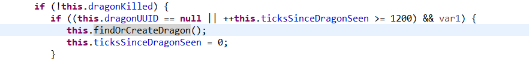
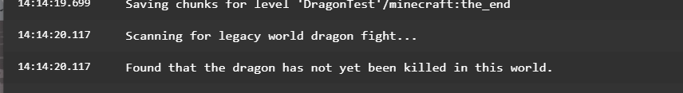
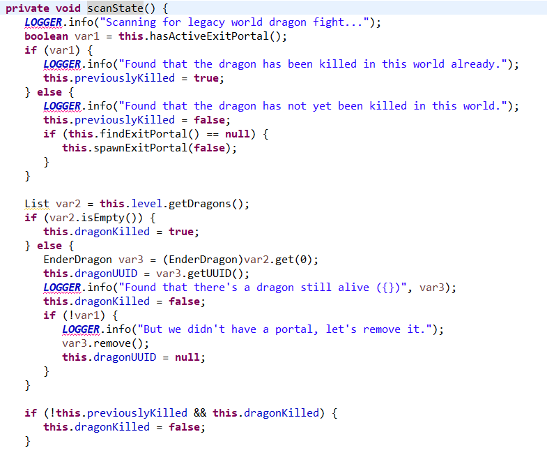
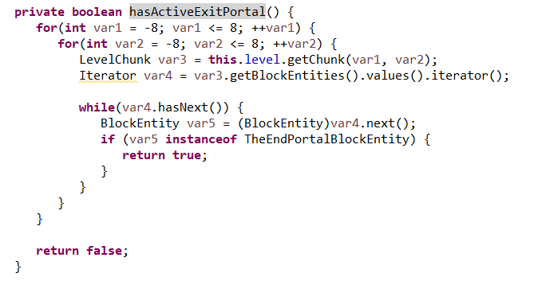
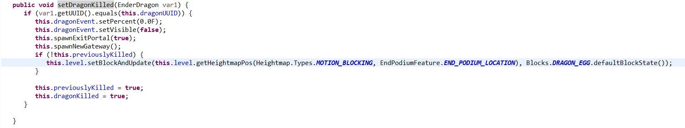
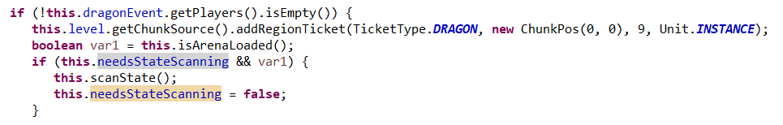

# 从源码角度解析 Minecraft 龙战运作机制（六）——离奇复活的末影龙

*\*本文使用的是 Minecraft 1.16.1 原版反编译得到的代码*

前几天 MIZUkiYuu 在 OSTC Lab 分享了一个特性：在末地破坏所有传送门方块之后重进存档，末影龙会重生，重生的末影龙击杀后掉落 12000 经验以及重新生成龙蛋。在几天的代码挖掘之后，结论已经基本定形，现在可以把探索过程分享出来。

首先，既然是龙战相关内容，那就直奔 `net.minecraft.world.level.dimension.end.EndDragonFight`。最先引起我注意的就是 `EndDragonFight.createNewDragon()` ，它在末地（0，128，0）的位置创造一条末影龙。对这个方法进行调用的有 `EndDragonFight.setRespawnStage(DragonRespawnAnimation)` 和 `EndDragonFight.findOrCreateDragon()` 。前者会在末影龙复活动画结束后创造一条龙，显然不是我们要寻找的；后者在 `EndDragonFight.tick()` 被调用，并且有一个末影龙死亡判定和末影龙存在判定，似乎有点意思。
 

然后我复现末影龙再生现象时，玩家进入末地，后台是这么输出的：

 
如果是自己开过服务器的玩家，应该对这段话很熟悉。在这里我们明明已经击杀了末影龙，游戏却判定龙没有死。追踪这句话我找到了 `EndDragonFight.scanState()` 方法。
 

方法 `EndDragonFight.scanState()` 做了以下几件事：判断是否是第一次打龙（确切来讲，龙之前是否被杀）、判断上次退出存档时龙是否已死并进行错误纠正。此处判断是否是第一次打龙的依赖 `hasActiveExitportal()` 的结果，那么追踪 `hasActiveExitPortal()` 的代码。

 
这段代码的大意就是遍历以（0,0）区块为中心17*17区块区域的末地门/折跃门（至于为什么包括折跃门请看此系列专栏的第二篇），若存在至少一个方块则认为龙在之前已经被杀过。此时就出现了问题：在正常游戏流程中，玩家第一次击杀龙之前末地确实没有传送门方块（返回传送门未开，折跃门未生成）；但是现在的特殊情况就是玩家手动破坏了所有传送门/折跃门方块，于是在判定时，游戏找不到此类方块，进而认为龙之前没有被杀死过。

随后 `if(!this.previouslyKilled && this.dragonKilled) {this.dragonKilled = false;}` 这句代码对记录龙的死亡状况的两个变量进行比较，如果龙之前未被杀过，游戏会判定龙未被击杀。

现在再回到 `EndDragonFight.tick()` ，一切就很明了了：游戏判断龙没有死，但是此时末地并不存在龙，所以自玩家进入末地1200刻之后游戏执行自检，直接生成一条末影龙。

 
**但是现在还有两个疑点未完全解开：为什么一开始龙未出现但是有boss栏？以及为什么龙掉落 12000 经验并且还会生成龙蛋？**

显示末影龙血条部分写在 `EndDragonFight.tick()` 第一句：`this.dragonEvent.setVisible(!this.dragonKilled);` 通过 `dragonKilled` 变量，也就是判断龙是否已死的变量来控制 boss 栏的可见性，而不是通过判断龙的存在性来控制。

掉落经验部分写在在 `net.minecraft.world.entity.boss.enderdragon.EnderDragon.tickDeath()` 方法中，通过查询 `EndDragonFight` 类的实例中的 `previouslyKilled` 变量确定是否是第一次杀龙，然后据此设定掉落的经验量。既然前面生成龙的时候已经判定是第一次杀龙了，那掉落的经验也是第一次杀龙的量。
 

生成龙蛋部分写在 `net.minecraft.world.level.dimension.end.EndDragonFight.setDragonKilled()` 方法中，同样也是检查 `previouslyKilled` 变量然后决定是否生成龙蛋。生成龙蛋时在 (0,0) 寻找最高方块并将龙蛋生成在此方块上一格。
 

现在，整个过程都很清楚了，在此统一整理一遍：

首先，玩家手动破坏末地主岛内（以 (0,0) 区块为中心 17×17 区块内）所有末地传送门/折跃门方块，在任意位置退出存档；

然后玩家重新打开存档，进入末地触发末地龙战检查，游戏认为龙没有被杀死过，同时也认为龙没有死，开始执行龙战相关代码；

因为龙被判定为未死，显示 boss 栏，此时末地并没有龙；

1200 刻后，游戏没有检查到末影龙，于是重新生成一条，战胜后的战利品与第一次杀龙相同。

注意末地龙战检查每次打开存档仅触发一次，服务器的话就是每次启动后仅触发一次。原因是 `needStateScanning` 变量在游戏初始化时被赋值为 true，其后在执行末地龙战检查后会设置为 false，没有其他地方修改这个变量的值。

 
若想利用这个特性做末影龙经验农场，也许不适合用在服务器，因为每击杀一次龙就需要重启，对服务器来说并不方便。

此外，根据前文所述原理，还可以拓展别的玩法：

1.	只破掉折跃门然后复活龙，待龙复活之后重进存档杀龙可以获得第一次打龙的战利品，工作量相对破掉所有传送门更小，也不用经历进入末地等待 1200 刻的空闲期；

2.	在第一次杀龙前用作弊方法在主岛内（简称）生成末地传送门/折跃门方块，然后重进存档，击杀龙将不会有第一次杀龙产生的战利品。

 
 
 
 

《从源码角度解析 Minecraft 龙战运作机制（六）》 © 2020 作者: Youmiel 采用 CC BY-NC-SA 4.0 许可。如需查看该许可证的副本，请访问 http://creativecommons.org/licenses/by-nc-sa/4.0/。