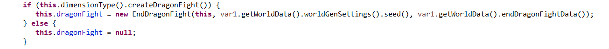

# 从源码角度解析 Minecraft 龙战运作机制（七）——更多特性

*\*本文使用的是 Minecraft 1.16.1 原版反编译得到的代码*

在开始前对上一篇文章作补充：

之前分析末影龙离奇复活现象的时候漏写了 `ServerLevel` 和 `EndDragonFight` 的构造器（如果不知道构造器是什么可以将它简单认为是龙战机制开始运作前的初始化工作）。




构造器中主要依次做了三件事：

- 初始化末地龙战的 boss 事件（boss 栏颜色、boss 迷雾等）；
- 从文件（也就是 level.dat）读取龙战的各项信息：龙巢位置、末影龙存活状况、末影龙的 UUID、未开启的折跃门列表。并进行例外状况处理；
- 通过硬编码构建龙巢的结构信息，用于生成、寻找龙巢。
但是无论构造器中如何读取文件信息，后续 `scanState()` 造成的误判仍旧可改写龙的存活情况。

---------------------------------------------------------------------------------------------------------------------------------

上回分析 MIZUkiYuu 发现的特性时重新看了一遍代码，发现还有一部分内容在之前被我忽略了，在此作一个补充。

首先来解析一下 `EndDragonFight.tick()` 方法的流程，此方法在 `ServerLevel.tick()` 中被调用，控制着整个末地龙战的过程。大致流程如下：
-	每20刻扫描末地中的玩家列表
-	若末地中有玩家，则：
    -	在末地(0,0)区块添加类型为“龙”的加载票（1.16新加入的机制）；
    -	末影龙存活情况检查，每次打开存档有且仅有一次；
    -	监控末影龙复活进度/推进复活进程；
    -	屠龙战中的各项检查：
        -	每1200刻检查龙的存在性；
        -	每100刻检查水晶剩余数量；
-	末地中无玩家则移除“龙”加载票；


 
先说加载票，~~1.16 的“龙”类型加载票在玩家进入末地便会添加，与此前需要屠龙战的要求出现变化（参考 [cv3395631](https://www.bilibili.com/read/cv3395631)）。即便玩家通过折跃门离开主岛，主岛由于龙加载票的存在仍然可以加载。可以将这一特性理解为末地的“出生点常加载区块”。~~    “龙”类型加载票只要求玩家在球体范围内，与 [cv3395631](https://www.bilibili.com/read/cv3395631) 所说的需要屠龙战的要求出现出入（我不知道是怎么回事，但是我相信我的结论是对的）。之前常常有人开玩笑说末地混凝土固化机在没有 Carpet mod 的假人情况下可以召唤一条龙来加载，现在只需末地维度有人即可。

另外，每 1200 刻检查龙的存在性除了可以离奇复活末影龙，还可以制造 N 条龙同时存在的情况，方法就是将龙挪到未加载区块使得游戏在寻找龙的时候找不到，于是另一条龙会在 (0,128,0) 生成，如此重复即可。

之后的各种检查什么的感觉没什么意思就不细讲了，就是

```java
this.level.getChunkSource().addRegionTicket(TicketType.DRAGON, new ChunkPos(0, 0), 9, Unit.INSTANCE);
boolean var1 = this.isArenaLoaded();
```

这两句，添加了加载票然后再检查主岛 (0,0) 区块为中心 17×17 区块是否加载究竟是为什么呢……

然后依然是第六篇提及的 `EndDragonFight.scanState()`，不过这次关注的是中间部分：


中间部分在整个维度中寻找所有的龙并创建一个列表，当找不到龙的时候就判断龙已经被击杀；找到龙后，若龙巢不存在返回传送门（事实上是以 (0,0) 区块为中心 17×17 区块内不存在末地传送门/折跃门方块，前面已经多次强调），就将记录龙的列表中的第一条龙删去。在实际实验过程中龙是被删去了然后在 (0,128,0) 重新生成，给玩家的感觉就是龙的血量和位置被重置了。一般而言，这种现象只发生在第一次屠龙的时候，但是这样删除龙的操作着实令人迷惑，可能的解释就是游戏设计者刻意增加第一次杀龙的难度（然而在经验丰富的玩家面前并没有难度可言）。

-----

综合前述的诸多特性，在此提出一个**粗糙的想法**：一种特殊的末影龙经验农场。

首先，破坏主岛附近所有的末地传送门/折跃门方块，然后重进存档，将重生的龙用[**某种方式**]牵引至未加载区块并关入[**某种稳定抗卸载的末影龙笼子**]，等待游戏生成新的龙，如此反复，“缓存”若干条龙。当缓存足够后，将最后一条龙击杀，创建返回传送门恢复维度通行。

需要使用经验时，先破坏主岛附近所有末地传送门/折跃门方块，随后抵达[**末影龙笼子**]，重进存档，此时应该会有一条龙被删除，同时在末地 (0,128,0) 生成新的龙，假如有[**快速击杀龙的办法**]，获取大量经验应该不会太难。如果需要多次提取，可以通过在复活龙的过程中重进存档简单移除龙巢的传送门方块，然而实现这个方法要求折跃门全开并且全部被破坏，通往末地外岛的交通需要通过鞘翅或者末地超传实现。


<br>
<br>
<br>
<br>

《从源码角度解析 Minecraft 龙战运作机制（七）》 © 2020 作者: Youmiel 采用 CC BY-NC-SA 4.0 许可。如需查看该许可证的副本，请访问 http://creativecommons.org/licenses/by-nc-sa/4.0/。