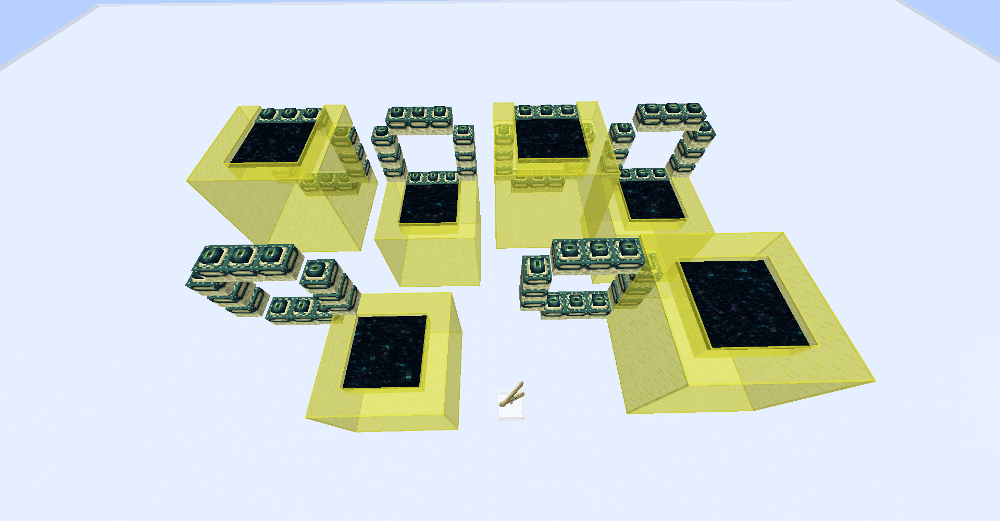
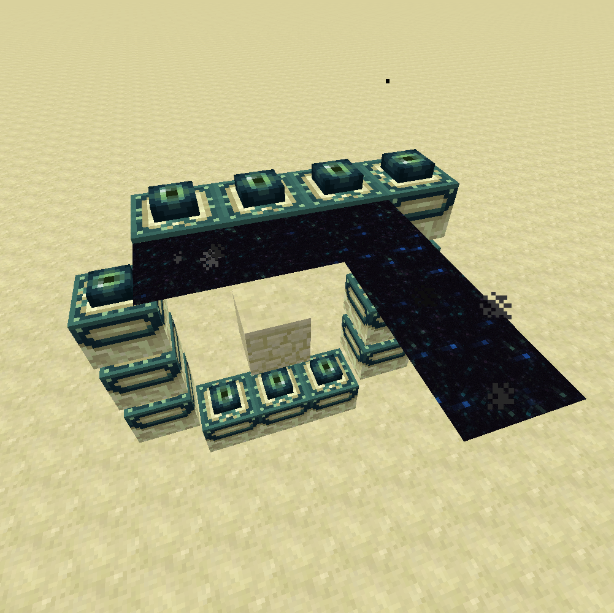
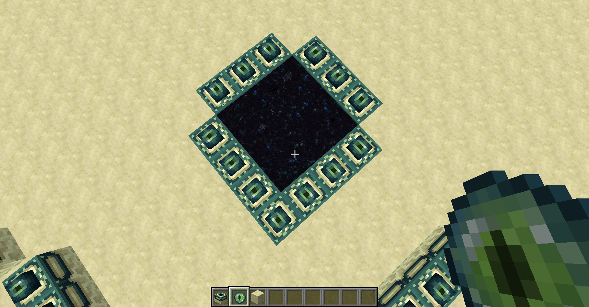

# 奇葩的末地门框架，竖着放也能用

重新回顾了末地传送门框架结构判定，整理了这个特性的历史，再发一次动态

Mojang: 没有人比我更懂结构判定。 

为了让雪傀儡和铁傀儡能够任意旋转结构召唤，一个结构在判定过程中会被旋转比对多次，末地传送门框架的判定逻辑也是同样的。 

此判定逻辑在1.9才出现，到目前1.16.4基本没有变化，除了1.9需要末地传送门框架围出的3*3方形区域内(横着和竖着摆都是，竖着的情况见图二) 没有方块阻挡，wiki也指出1.10之前末地传送门的激活可以被方块所阻止(图四)。1.8及之前(仅测试了1.7与1.8)只有平放的末地传送门框架结构可以正常开门，并且没有角落激活的特性。

注意：黄色染色玻璃标记的正方体区域是可以成功激活末地传送门结构的位置(图一)，只需要在这个范围里有末地传送门框架被填充末影之眼即可激活末地传送门。这意味着正常平放的末地门框架也可以在结构角落放置一个空框架并填充末影之眼来重新激活(图三)。

~~这几个奇葩的门我丢在CCS的OSTC Lab了，有兴趣的可以自己去看看~~。（为什么划掉：因为服关了）

麻将你到底在干什么啊麻将

