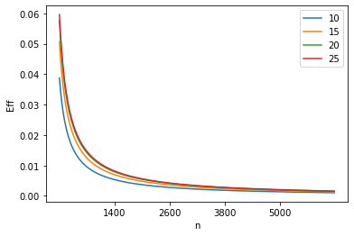
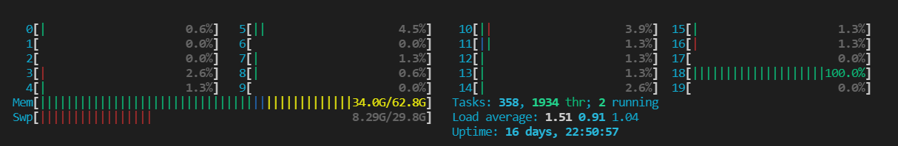
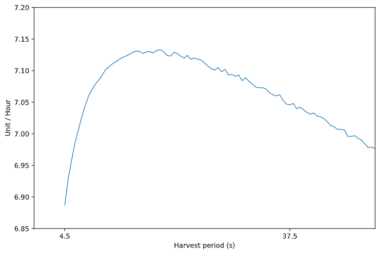
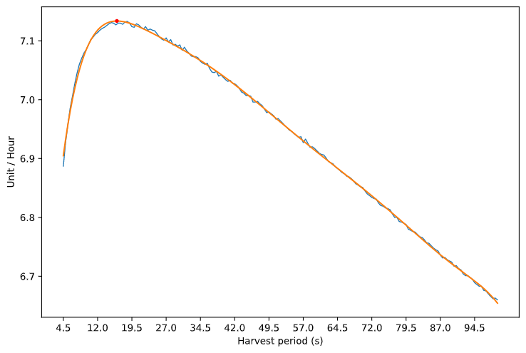
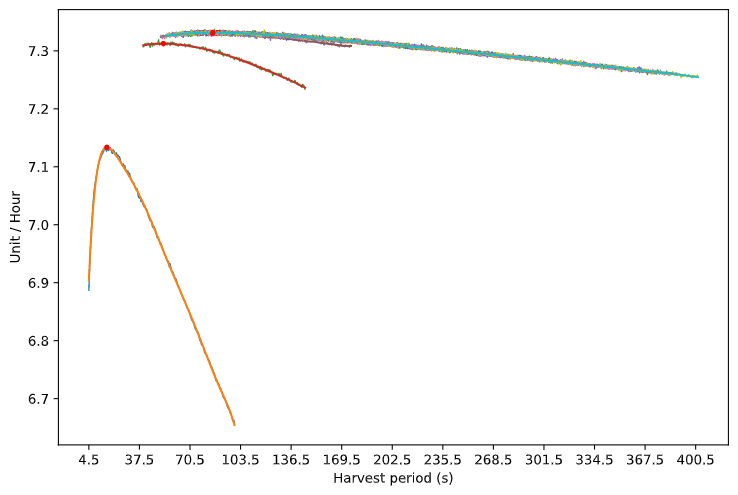
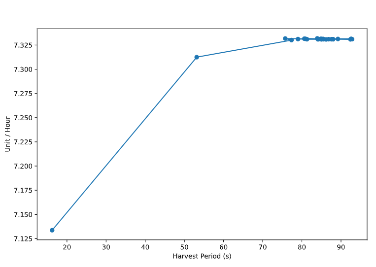
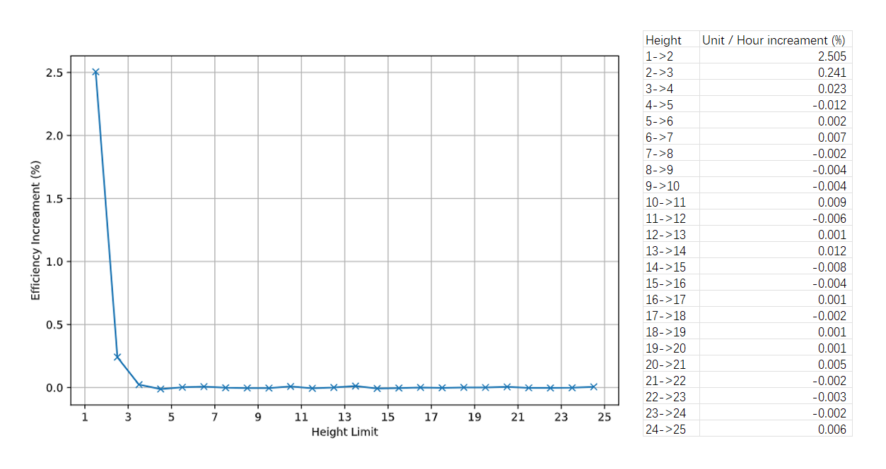

# \[Minecraft\]用计算机程序模拟分析海带生长规律
*最开始，我只是想借用这个研究来学习更多的Python技能，例如熟悉matplotlib、numpy等模块，用于未来的学习和工作。我最初以为这是件很简单的事情，只需要每天下午抽出几个小时来便能轻松完成。然而，从我这个想法真正进入开发到本文开始撰写，却间隔了十天有余，这个研究项目已经变成了两种语言、多线程/进程处理、GPU加速计算的大杂烩。撰写本文除了给出部分研究结果，也是对我当前状态的简单记录。*
## 零 \- 先前的研究、感谢名单以及结论指向
- 前置研究
  - Redberd小红在[cv12778288](https://www.bilibili.com/read/cv12778288)使用MATLAB作图分析海带生长高度。
  - 肥啾U_ruby与镍镍等人用数学计算的方式推导单个海带的效率公式，研究内容记录于[cv12830269](https://www.bilibili.com/read/cv12830269)

- 特别感谢：
  - TokiNoBug(B站ID：窃梦家) 等人使用数学计算优化Minecraft中的生产机械
  - 肥啾U_ruby、menggui233、redberd小红、镍镍等人在海带农场计算的先行研究
  - ishland为本项目编写了GPU加速的模拟程序，使得可接受的时间内进行高精度模拟海带生长成为可能
  - Dreamily854将自己的家用服务器计算资源共享给我和ishland
  - TIS Lab 与 OSTC Lab 众多玩家的宝贵讨论

- 结论指北：
  - 结论在这篇文章最后，快速滑动过去即可

## 壹 - 已知信息以及存在的问题
- 海带农场所涉及到的相关机制可以总结为以下几点：
    - 在Java版Minecraft中，在每个游戏刻（gametick），加载等级在31级或以下、区块中心与最近的玩家的水平距离小于128的区块会执行随机刻。（信息来源：Minecraft中文wiki - 刻#随机刻）
    - 每个执行随机刻的区块，会按照子区块（又称区段/subchunk，大小为16\*16\*16方块）为单位，自下而上，每个子区块选择randomTickSpeed（游戏规则-随机刻速度，默认为3）个方块计算相应随机刻，不考虑随机刻执行是否是否成功也不考虑选择的方块是否重复。
    - 海带只有海带尖端（即数据值为kelp的方块）接受随机刻，海带其他部分（kelp_plant）收到随机刻不执行任何动作。
    - 海带尖端接受到随机刻时有14%的概率生长一段，生长方式为自身所在位置变为kelp_plant，上方水方块（向下流动或者水源）变为kelp，执行时刻为随机刻命中时。
    - kelp方块带有一个age 状态，每次生长时age增加1，直到age = 25，其他情况被创建（玩家放置/自然生成/收割）时，age会被随机赋予一个0~24的值，分布方式为平均分布。

根据以上特性，肥啾和镍镍列出了海带生长的理论期望，并推导出了理论效率。然而，将效率公式作图，得到的图像大约是这样:<p>
<p>
<p>
先不谈计算结果的数值问题，可以发现图像是一个单调递减的曲线，这似乎在告诉玩家，`收割周期越短，单株海带的理论效率就越高` 。显然这是不可能的，因为计算式中忽略了一个重要因子，就是在收割周期足够短的情况下，每次收割造成的生长空档是不可忽略的。最明显的一点就是水流速度: <u>活塞破坏海带之后，留下的是空气方块，水流需要5gt时间来填补这个空隙</u>，在这5gt时间内，海带将不能生长。正因如此，假如收割周期为10gt，这就意味着在海带农场运行时间内，海带有**一半时间**不能生长。
## 贰 - 程序构建全过程
为了弥补前者的这一缺陷，获得更接近实际情况的结果，我决定在计算过程中加入更多影响因素。包括：

- **随机刻速度**：也就是/gamerule randomTickSpeed
- **收割周期**：收割周期
- **限高**：海带最多能生长的高度
- **空档时间**：每次收割后留下的不允许海带生长的时间，例如水流速度将这个时间限制在在了至少为 5gt 的下限
- **随机刻、计划刻先后顺序**：1.14~1.17，随机刻阶段在计划刻前；1.13.x & 1.17.1，随机刻阶段在计划刻之后
  
我和ishland的程序源码放在了GitHub，`main`分支对应我用Python实现的模拟算法，`master`分支对应ishland使用Java调用OpenCL API实现的利用GPU计算的模拟算法。此处是链接：https://github.com/Youmiel/KelpSimulator

根据[第一部分](#一---已知信息以及存在的问题)，先构建单个海带的类：<br>
``` python
class Kelp():
    growth_probability = 0.14

    def __init__(self) -> None: # 初始化
        self.init()

    def init(self): # 初始化和重置共用一段代码
        self.age = random.randint(0,24)
        self.start_age = self.age
        # 只需要记录最初的age和当前age，即可计算得海带高度

    def tick(self): # 每次随机刻选中海带之后进行的计算
        if self.age < 25 and random.random() < Kelp.growth_probability:
            self.age += 1

    def harvest(self) -> int: # 收割，返回收割获得的海带数量
        result = self.age - self.start_age
        self.init()
        return result
    
    def reset(self): # 重置状态
        self.harvest()
```
然后是由海带个体组成的海带农场的类：
```python
class KelpFarm():
    segement_size = 16**2 # 模拟每个区块最多放置256个海带
    subchunk_size = 16**3 # 子区块大小，用于计算随机刻
    def __init__(self, kelps: dict, config: dict) -> None:
        # 初始化
        # ...
        # 代码受限于篇幅，略
        pass

    def task_name(self) -> str:
        # 根据传入配置生成的任务名字，用于向stdout输出文字
        return self.task_name

    def start(self) -> tuple:
        # 开始计算
        lo = multiprocessing.Lock()
        lo.acquire()
        print('Start simulating:' + self.task_name + '\n', end='')
        lo.release()
        return self.simulate()
    
    def simulate(self) -> tuple:
        # 模拟计算并返回最终计算结果
        for self.gametick in range(self.test_time):
            self.tick()    
        eff = decimal.Decimal(self.item_count) /\
                decimal.Decimal(self.kelp_count * self.test_time / 72000.)
        return(config, eff)

    def tick(self):
        # 每gt运算内容，包括随机刻、计划刻、收割等
        # ...
        # 代码受限于篇幅，略
        pass
```
然后是主函数，基本上只是个提纲
```python
load_config("./config-multiprocess.json")
init()
start()
show_result()
```
最开始我对我的模拟程序过于自信，认为这个计算任务不过是小事一桩，所以只使用单线程运行。然而实际的结果却是“一核有难，十九核围观”：


最后不得不使用多进程并行来加快计算速度，Python的并行处理分为多线程和多进程，但是Python的多线程仍然是由一个进程处理，所以此处选择多进程，才能发挥出多核CPU的优势：
```python
import multiprocessing

load_config("./config-multiprocess.json")
init()
with multiprocessing.Pool(processes=config['process_count']) as pool:
    start(pool)
show_result()
```
其他部分的代码就不放在专栏中了，有兴趣的朋友可以自行去GitHub查看。

随后ishland用Java重新编写了模拟程序，并且使用OpenCL调用GPU加速计算，计算速度更为优秀，见：https://github.com/Youmiel/KelpSimulator/tree/master

## 叁 - 数据分析以及结果呈现
模拟程序完成后，模拟了收割周期从10gt（0.5秒）至72000gt（1小时）以10gt为步进，限高从1~25共计18万种情况，每种模拟1000小时，测试海带数量2048。数据处理和展示使用Python的numpy和matplotlib模块。

测试数据直接绘图，放大之后图线仍然有波动，不过曲线在收割间隔接近10gt时快速下降，和预期情况大致相符：


用`numpy.polynomial.Polynomial.fit()`进行曲线拟合（方法使用的是最小二乘法拟合），得到如图的曲线以及一个极值点：


处理所有25种限高的情况（只展示了每条曲线极值点附近的部分），可以发现在限高大于一定值的时候，绘制的曲线几乎重合：


将25个限高的极值点提取出来组成图表之后，可以发现除了第一、第二两点以外，其余极值点几乎都密集分布在有限的范围内；同时，每**单元效率**随限高增加的**增长率**，在高度3以后几乎为0（出现负值等波动是因为测试时间不够，不是精准数据）


## 肆 - 研究小结
- 模拟场景仅限于不检测海带农场并且收割海带只是用活塞推动，没有在活塞收回后下个gt使用发射器填充水（这种想法的来源：Fallen_Breath）
- 设计海带农场不能一味地缩短收割间隔来追求高产量，在收割间隔过小的时候，效率会急剧下降。
- 大于3的限高在多数情况下不会使单个海带提供更多的效率，除了增加农场的体积和耗材。
- 限高为1时，最高效的收割周期大约为16s；限高为2时，最高效的收割周期大约为53s；在限高大于等于3时，最高效率的收割周朝大约在75~95s区间内。