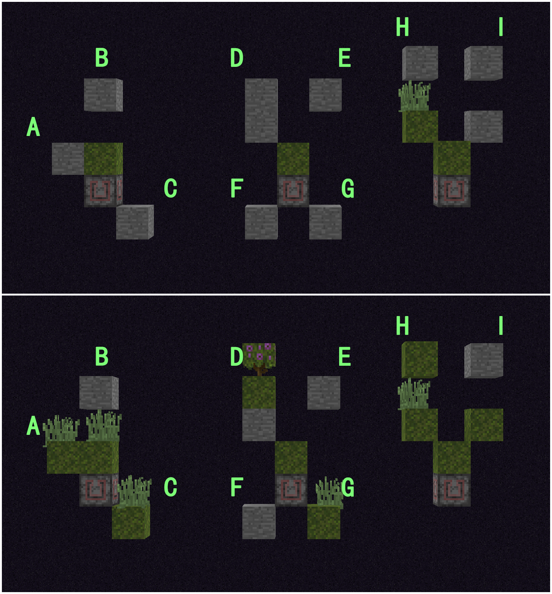

# Minecraft Java版本 1.17~1.18 苔藓块特性总结
*本文有些内容wiki也能搜索到，甚至于有一部分我是从wiki上参考的，后面特别标明，但是wiki本身记录的内容和实际情况也有出入。*

*这篇专栏的内容深度是逐渐增加的，当你发现某些内容无法读懂时，请暂停阅读，因为后面的内容不会是你现在需要的了，不妨到你具备足够的知识、真正需要这些信息时再来了解。*

*专栏内容对应 Java版本 1.17~1.18，未来版本不确定是否会有改动，需要进一步验证。*


## 方块共有属性

*可用/info（carpet指令，可用/carpet commandInfo true开启）看到大多数。*

属性名称 | 情况
-|-
光源 | 否
透光性 | 不透光
窒息 | 是
可起火 | 否
可燃尽 | 否
随机刻影响 | 否
表面可刷怪 | 是
红石信号源 | 否
传导信号/压线/压箱（isNormalCube） | 是
材料类别 | 苔藓（MOSS），有且只有苔藓块使用了这个材料类别
最佳开采工具 | 锄，石锄及以上可以瞬间破坏
开采硬度/爆炸抗性 | 开采硬度：0.1，爆炸抗性：0.1
碰撞箱/方块表面 | 碰撞箱完整，是完整方块；方块选择框完整
活塞交互 | 可通过活塞推动破坏，不可拉动
地图显示颜色 | 绿色，与绿色羊毛、绿色潜影盒、绿色染色玻璃、绿色带釉陶瓦、绿色混凝土等同色

## 可附着方块
### 由方块标签控制的
- 所有可以附着在带有`#minecraft:dirt`标签的方块。
  - 各种树苗
  - 枯木
  - 甘蔗
  - 竹子
  - 浆果丛
  - 小型/大型花
  - 草/高草
  - 蘑菇（亮度满足时）
  - 西瓜/南瓜梗将其判定为合法结果位置

### 其他（通常是方块表面）
- 所有可以在完整表面附着的方块
- 地毯等只需要下方有方块支撑的方块
- 告示牌、画、物品展示框、荧光物品展示框、旗帜
  - 以上五者要求所附着的方块是固体方块，判据为方块的材料类别（`((Material)obj).isSolid()`）
  - https://minecraft.fandom.com/zh/wiki/%E5%9B%BA%E4%BD%93%E6%96%B9%E5%9D%97

## 来源（摘自Minecraft Wiki）
### 自然生成
- 苔藓块自然生成于繁茂洞穴生物群系。

### 蔓延
- 对**上方为空气**的苔藓块使用骨粉会使周围的多种方块转变为苔藓块。详见[#传播](#传播)

### 交易
- 流浪商人有 `5/一级交易总数` 的概率以1个绿宝石的价格出售2个苔藓块。
  - 在1.17.1中，是5/62
- 附 1.17.1 yarn-mapping 得到的源码，有能力的可以参考我写的注释自行验证

```java
//net.minecraft.entity.passive.WanderingTraderEntity#fillRecipes()
@Override
protected void fillRecipes() {
    TradeOffers.Factory[] lvs = (TradeOffers.Factory[])TradeOffers.WANDERING_TRADER_TRADES.get(1);
        //一级交易，共62个
    TradeOffers.Factory[] lvs2 = (TradeOffers.Factory[])TradeOffers.WANDERING_TRADER_TRADES.get(2);
        //二级交易，共6个
    if (lvs == null || lvs2 == null) {
        return;
    }
    TradeOfferList lv = this.getOffers();
    this.fillRecipesFromPool(lv, lvs, 5); //从一级交易里不重复地抽取5个
    int i = this.random.nextInt(lvs2.length);
    TradeOffers.Factory lv2 = lvs2[i]; //从二级交易里随机抽取1个
    TradeOffer lv3 = lv2.create(this, this.random);
    if (lv3 != null) {
        lv.add(lv3);
    }
}

//net.minecraft.entity.passive.MerchantEntity#fillRecipesFromPool()
protected void fillRecipesFromPool(TradeOfferList recipeList, TradeOffers.Factory[] pool, int count) {
    HashSet<Integer> set = Sets.newHashSet(); //HashSet，其中的元素不会重复
    if (pool.length > count) {
        while (set.size() < count) { //集合大小小于抽取数量时就进行随机抽取
            set.add(this.random.nextInt(pool.length));
        }
    } else { //抽取数量多于可抽取数量时直接将整个交易池加入集合
        for (int j = 0; j < pool.length; ++j) {
            set.add(j);
        }
    }
    for (Integer integer : set) { //将选择的交易项目逐个加入商人的交易列表
        TradeOffers.Factory lv = pool[integer];
        TradeOffer lv2 = lv.create(this, this.random); 
            //这个random在交易项目涉及附魔物品、染色盔甲时才会用到
        if (lv2 == null) continue;
        recipeList.add(lv2);
    }
}
```

### 箱子战利品
- 仅写Java版的情况，因为我没怎么接触基岩版，不清楚基岩版的箱子战利品机制如何，我不知道wiki是怎么确定基岩版和Java版在此处机制相同的。顺便，我也不知道为什么wiki在此处特别标明Java版和基岩版相同，而在前面所有内容既没有说明是否相同，也没有说明是哪个版本特有。

物品|苔藓块||
-|-|-
来源|沉船补给箱|*补给箱是位于沉船船头的那个箱子，常见物品是食物和皮革盔甲等*
堆叠数|1-4|
概率|42.06%|
物品数量期望|1.05|= 堆叠数量期望 * 概率
箱子数期望|2.4|= 1 / 概率

## 物品处理
### 合成
- 可用于合成苔藓地毯、苔石和苔石砖，是苔石和苔石砖的更方便获取方法，因为量产苔藓块比量产藤蔓更方便。
  - 详见 https://minecraft.fandom.com/zh/wiki/%E8%8B%94%E8%97%93%E5%9D%97#%E5%90%88%E6%88%90

### 堆肥
- 将苔藓块放入堆肥桶会有65%的几率增加一层堆肥层，注意堆肥桶空的时候不管用什么堆肥都是100%概率增加一层，所以N数量的相同物品堆肥出骨粉的数量期望为 `N / (6 / 堆肥概率 + 1)`

## 传播
### 影响方块
- 所有拥有`#minecraft:moss_replaceable`标签并且**上表面完整**的方块，原版数据包中是
  - 石头、花岗岩、闪长岩、安山岩、凝灰岩、深板岩
  - 泥土、草方块、灰化土、沙土、菌丝、根土、苔藓块
    - 你没看错，“我变我自己”。
- 原版数据包的方块标签文件：
```json
//moss_replaceable.json
{
  "replace": false,
  "values": [
    "#minecraft:base_stone_overworld",
    "#minecraft:cave_vines",
    "#minecraft:dirt"
  ]
}
```
```json
//base_Stone_overworld.json
{
  "replace": false,
  "values": [
    "minecraft:stone",
    "minecraft:granite",
    "minecraft:diorite",
    "minecraft:andesite",
    "minecraft:tuff",
    "minecraft:deepslate"
  ]
}
```
```json
//cave_vines.json
{
  "replace": false,
  "values": [
    "minecraft:cave_vines_plant",
    "minecraft:cave_vines"
  ]
  /*
  这两个方块无用，因为洞穴藤蔓上表面不完整，被写在标签里是因为标签moss_replaceable
  被标签lush_ground_replaceable引用，后者用于繁茂洞穴生成
  */
}
```
```json
//dirt.json
{
  "replace": false,
  "values": [
    "minecraft:dirt",
    "minecraft:grass_block",
    "minecraft:podzol",
    "minecraft:coarse_dirt",
    "minecraft:mycelium",
    "minecraft:rooted_dirt",
    "minecraft:moss_block"
  ]
}
```
### 影响范围
- 苔藓块传播过程复用了世界装饰生成相关的代码，核心逻辑写在`net.minecraft.world.gen.feature.VegetationPatchFeature`和`net.minecraft.world.gen.feature.SimpleBlockFeature`（yarn mapping），生成繁茂洞穴顶部和底部的苔藓/粘土区域时都调用到了相关逻辑，参数不同。
- 水平范围：
  - 水平方向影响范围总体而言是5×5、5×7、7×5、7×7四种矩形中随机一种，其中：
    - 矩形四角转化概率为0
    - 除了四角以外矩形边缘一圈方块转化概率为0.75
    - 中心部分转化概率为0，因为中心本来就是苔藓块
  - 用图表示出来如下：
    - 
  - 综合四种情况可以绘制出如下的热图:
    - 
  - 这是某次苔藓块在石头平台上的传播结果，玻璃标明了被使用骨粉的苔藓块，白色混凝土是矩形范围的四个角落（概率0），边缘的红色混凝土是命中了（1 - 0.75）概率的未转化部分：
  
- 垂直范围：
  - 
  - 确定了水平传播范围之后，对于水平位置的每一纵列，在以苔藓块所在高度为中心，上下扩展5格，共11格范围里寻找合适的传播位置
    - 如果苔藓块所在高度上方一格有非空气方块，则选择上方5格内的最高非空气方块
    - 如果苔藓块所在高度上方一格是空气方块，则选择苔藓块高度以及下方5格内的最高非空气方块
- 若选中位置的方块拥有moss_replaceable标签，并且上表面完整，并且上方是空气方块，则将该位置替换为苔藓块
  - 例子：用数据包向`#minecraft:moss_replaceable`标签中添加橡木活板门后：
    
  - 关着的活板门门上表面完整，被替换为苔藓块；而开着的活板门因为上表面不完整，不能被替换为苔藓块
- 对于所有被成功转化的方块，在其上方按照权重配置生成植被覆盖
- 举个例子：
  

  方块编号 | 结果 | 原因
  | - | - | - |
  A | 传播 | 苔藓块所在高度上方一格是空气方块，A是苔藓块高度以及下方5格内的最高非空气方块
  B | 不传播 | 苔藓块所在高度上方一格是空气方块，无法向上搜寻到B
  C | 传播 | 同A
  D | 传播 | 苔藓块所在高度上方一格是非空气方块，向上搜寻到最高非空气方块D
  E | 不传播 | 苔藓块所在高度上方一格是空气方块，无法向上搜寻到E
  F | 不传播 | 同一列优先搜索到D，忽略F
  G | 传播 | 苔藓块所在高度上方一格是空气方块，没有向上搜寻到E，G是苔藓块高度以及下方5格内的最高非空气方块
  H | 传播 | 苔藓块所在高度上方一格是非空气方块，向上搜寻，经过草丛方块到最高非空气方块H
  I | 不传播 | 苔藓块所在高度上方一格是非空气方块，向上搜寻，但是I下方有一格空气，搜索中断，只能找到I下方两格的石头方块
### 生成植被覆盖
- 这部分的概率我和Nickid2018、wiki编辑人员之间商量多次，最终确定的表格如下，也就是wiki上的那张。

概率 | 植被种类 | 权重 | 最终
-|-|-|-
40% | 不生成（空气）| - | 40% 
60% | 盛开的杜鹃丛 | 4 | 2.5% 
... | 杜鹃丛 | 7 | 4.375%
... | 苔藓地毯 | 25 | 15.625%
... | 草（一格高） | 50 | 31.25%
... | 高草（两格高） | 10 | 6.25%

- 特例：如果高草没有足够空间生成会转而生成空气

## 推论 - 基于苔藓传播的骨粉农场
- 如果让苔藓传播范围最大化，并把转化得到的所有产物都用于堆肥，大概能得到多少骨粉呢？
  - 根据前面的热图，每次催熟的转化的苔藓块数量期望是27
  - 按照植被覆盖生成概率表格，得到每种植被的生成期望
    - 盛开的杜鹃丛：27 * 2.5% = 0.675
    - 杜鹃丛：27 * 4.375% = 1.18125
    - 苔藓地毯：27 * 15.625% = 4.21875
    - 草：27 * 31.25% = 8.4375
    - 高草：27 * 6.25% = 1.6875 
- 因为苔藓农场的产量一般都比较大，多数堆肥桶最终会持续堆肥一种物品，所以我们可以用每种产物单独堆肥的骨粉产出来估算最终产出，表格如下：

方块 | 生成期望 | 产物 | 掉落概率 | 物品堆肥概率 | 产出骨粉期望
-|-|-|-|-|-
苔藓块 | 27 | 苔藓块 | 100% | 65% | 2.639097744
盛开的杜鹃丛| 0.675 | 盛开的杜鹃丛 | 100% | 85% | 0.083759124
杜鹃丛 | 1.18125 | 杜鹃丛 | 100% | 65% | 0.115460526
苔藓地毯 | 4.21875 | 苔藓地毯 | 100% | 30% | 0.200892857
草 | 8.4375 | 小麦种子 | 12.5% | 30% | 0.050223214
高草 | 1.6875 | 小麦种子 | 12.5% | 30% | 0.010044643
| - | - | **骨粉** | - | - | 3.099478109 |

- 所以我们可以认为，在理想状况下，基于苔藓传播的骨粉农场 `投入/产出比例` 大约为 1:3.1，去掉农场运行时消耗的骨粉求得的`净产出`为 `2.1（骨粉/次催熟）`，理想状态下的骨粉农场效率计算式为 `骨粉效率（每小时）= 72000 / 发射器激活周期 * 2.1`
  - 假如苔藓的传播面积因为机器设计问题不能全部利用，那么需要按照热图重新计算苔藓块产出期望，以及后续植被覆盖的产出期望
  - 假如苔藓的传播面积因为机器设计问题正好被遮住一半，那么产物的产出变为原来的1/2，那么 `投入/产出比例` 将变为 1:1.55，`净产出`n变为 0.55，只有理想情况的1/4左右，为了达到相同骨粉输出效率所需要的机器数量变为理想情况的4倍

- 如果不考虑骨粉消耗，直接输出产物，理想状况下每次传播，产物数量期望为34.340625，效率计算式为 `总效率（每小时）= 72000 / 发射器激活周期 * 34.340625
`
  - 30gt时钟下的理想效率是 82417.5（物品/小时）

## 推论 - 泥土农场
- 大型云杉树在生长的时候会将下方带有`#minecraft:dirt`标签的方块转换为灰化土，而苔藓块也带有`#minecraft:dirt`标签
  - 于是就有 石头 -> 苔藓 -> 灰化土 -> 泥土物品（方块破坏处理）的泥土再生路线，相比之前版本使用沙砾和泥土合成砂土再用锄头变回泥土的方案更容易自动化
    - 而且这个思路在1.17快照一经提出，很快就有人做出原型机了
- 因为不了解云杉生成灰化土的具体机制，此处无法再提供更多信息


# 代码分析

*方便起见，此处使用的反混淆表是 1.17.1 yarn mapping，也就是fabric维护的反混淆表。*

## Minecraft如何定义苔藓块传播行为

**这不是未定义特性**，而是有意为之的，自1.16开始，Mojang把很多世界生成相关的内容开放成数据包可配置的形式，分成biome、configured_carver、configured_feature、configured_structure_fature、configured_suface_builder、noise_settings、processor、template_pool几类，苔藓块在繁茂洞穴中的生成，以及使用骨粉后蔓延，都属于configured_feature类别，也就是**配置过的世界装饰**。

不过，值得注意的是，直到目前最新正式版1.18.1，修改下列配置的内容并不能改变苔藓块蔓延的行为，只对世界生成时在繁茂洞穴生成的苔藓团块生效。

### 配置参数
- 原版世界生成数据包中的配置：
```json
//minecraft/worldgen/configured_feature/moss_patch_bonemeal.json
{
  "config": {
    "vegetation_chance": 0.6, //每个成功转化的方块顶部生成植被覆盖的概率
    "xz_radius": { //xz轴范围，即水平方向的传播范围
      "type": "minecraft:uniform", //平均分布
      "value": {
        "min_inclusive": 1,
        "max_inclusive": 2
      }
    },
    "extra_edge_column_chance": 0.75, //边缘一圈方块的生成概率
    "extra_bottom_block_chance": 0.0, //替换方块厚度多于1的概率
    "vertical_range": 5, //上下搜寻的范围
    "vegetation_feature": "minecraft:moss_vegetation", //生成植被覆盖使用的装饰配置
    "surface": "floor", //贴靠的表面，有 floor 和 ceiling 两种，对应洞穴底部和顶部生成
    "depth": 1, //替换深度（或厚度），受extra_bottom_block_chance控制
    "replaceable": "minecraft:moss_replaceable", //被替换方块拥有的标签
    "ground_state": { //被替换成什么方块
      "state": {
        "Name": "minecraft:moss_block"
      },
      "type": "minecraft:simple_state_provider"
    }
  },
  "type": "minecraft:vegetation_patch" //调用的世界装饰方法，前面所有配置项都面向这项的参数需求所写。
}

//minecraft/worldgen/configured_feature/moss_vegetation.json
{
  "config": {
    "to_place": {
      "entries": [ //生成的植被列表
        {
          "data": {
            "Name": "minecraft:flowering_azalea"
          },
          "weight": 4 //权重，最终概率是（权重/权重和）
        },
        {
          "data": {
            "Name": "minecraft:azalea"
          },
          "weight": 7
        },
        {
          "data": {
            "Name": "minecraft:moss_carpet"
          },
          "weight": 25
        },
        {
          "data": {
            "Name": "minecraft:grass"
          },
          "weight": 50
        },
        {
          "data": {
            "Properties": {
              "half": "lower"
            },
            "Name": "minecraft:tall_grass"
          },
          "weight": 10
        }
      ],
      "type": "minecraft:weighted_state_provider"
    },
    "place_on": [],
    "place_in": [],
    "place_under": []
  },
  "type": "minecraft:simple_block"
}
```

对应的源码，另外 `MOSS_PATCH` 和 `MOSS_PATCH_CEILING` 也调用了 `Feature.VEGETATION_PATCH.configure()` ：

```java
//net.minecraft.world.gen.feature.ConfiguredFeatures#MOSS_PATCH_BONEMEAL
public static final ConfiguredFeature<VegetationPatchFeatureConfig, ?> MOSS_PATCH_BONEMEAL = 
  ConfiguredFeatures.register(
      "moss_patch_bonemeal", 
      Feature.VEGETATION_PATCH.configure(
          new VegetationPatchFeatureConfig(
              BlockTags.MOSS_REPLACEABLE.getId(), 
              new SimpleBlockStateProvider(
                  Blocks.MOSS_BLOCK.getDefaultState()
              ), 
              () -> MOSS_VEGETATION, 
              VerticalSurfaceType.FLOOR, 
              ConstantIntProvider.create(1), 
              0.0f, 
              5, 
              0.6f, 
              UniformIntProvider.create(1, 2), 
              0.75f
          )
      )
  );

//net.minecraft.world.gen.feature.ConfiguredFeatures#MOSS_VEGETATION
public static final ConfiguredFeature<SimpleBlockFeatureConfig, ?> MOSS_VEGETATION = 
ConfiguredFeatures.register(
    "moss_vegetation", 
    Feature.SIMPLE_BLOCK.configure(
        new SimpleBlockFeatureConfig(
            new WeightedBlockStateProvider(
                ConfiguredFeatures.pool()
                  .add(Blocks.FLOWERING_AZALEA.getDefaultState(), 4)
                  .add(Blocks.AZALEA.getDefaultState(), 7)
                  .add(Blocks.MOSS_CARPET.getDefaultState(), 25)
                  .add(Blocks.GRASS.getDefaultState(), 50)
                  .add(Blocks.TALL_GRASS.getDefaultState(), 10)
            )
        )
    )
);
```

可能需要对照 `VegetationPatchFeatureConfig` 类的构造器才能看懂

```java
//net.minecraft.world.gen.feature.VegetationPatchFeatureConfig#VegetationPatchFeatureConfig

/*
* Decompiled with CFR 0.0.6 (FabricMC 437c16e1).
*/
public class VegetationPatchFeatureConfig implements FeatureConfig {
    /*
    ...
    省略了一些读取json配置相关的代码
    */
    public VegetationPatchFeatureConfig(Identifier replaceable, 
                                        BlockStateProvider groundState, 
                                        Supplier<ConfiguredFeature<?, ?>> vegetationFeature, 
                                        VerticalSurfaceType surface, 
                                        IntProvider depth, 
                                        float extraBottomBlockChance, 
                                        int verticalRange, 
                                        float vegetationChance, 
                                        IntProvider horizontalRadius, 
                                        float extraEdgeColumnChance) {
        this.replaceable = replaceable;
        this.groundState = groundState;
        this.vegetationFeature = vegetationFeature;
        this.surface = surface;
        this.depth = depth;
        this.extraBottomBlockChance = extraBottomBlockChance;
        this.verticalRange = verticalRange;
        this.vegetationChance = vegetationChance;
        this.horizontalRadius = horizontalRadius;
        this.extraEdgeColumnChance = extraEdgeColumnChance;
    }
}
```

### 使用骨粉蔓延时的调用过程

对苔藓块使用骨粉时，isFertilizable()方法先被调用，判断苔藓块上方是否是空气方块，只有是空气方块时才能正常使用骨粉

grow()方法是真正调用苔藓块蔓延逻辑的地方
```java
//net.minecraft.block.MossBlock

/*
 * Decompiled with CFR 0.0.6 (FabricMC 437c16e1).
 */
public class MossBlock extends Block implements Fertilizable {
    public MossBlock(AbstractBlock.Settings arg) {//...}

    @Override
    public boolean isFertilizable(BlockView world, BlockPos pos, BlockState state, boolean isClient) {
        return world.getBlockState(pos.up()).isAir();
    }

    @Override
    public boolean canGrow(World world, Random random, BlockPos pos, BlockState state) {//...}

    @Override
    public void grow(ServerWorld world, Random random, BlockPos pos, BlockState state) {
        Feature.VEGETATION_PATCH.generate(
            new FeatureContext<VegetationPatchFeatureConfig>(
                world, 
                world.getChunkManager().getChunkGenerator(), 
                random, 
                pos.up(), 
                ConfiguredFeatures.MOSS_PATCH_BONEMEAL.getConfig()
            )
        );
    }
}
```

不管是前面的配置还是这里的grow()，都引用了一个名为`VEGETATION_PATCH`的对象，那么它是什么呢？

```java
//net.minecraft.world.gen.feature.Feature#VEGETATION_PATCH
public static final Feature<VegetationPatchFeatureConfig> VEGETATION_PATCH = 
    Feature.register(
        "vegetation_patch", 
        new VegetationPatchFeature(VegetationPatchFeatureConfig.CODEC)
    );
```

这句话的作用是把 `VegetationPatchFeature` 这个类注册为minecraft命名空间下名为vegetation_patch的地形装饰器，以供调用。繁茂洞穴的苔藓块生成、苔藓块蔓延等机制就是在这基础上加入不同的配置，才变成了实际加入游戏的内容。这也意味着，如果想用数据包/mod制造类似的景观，可以直接对这个装饰器进行配置，改变其中的参数，而不必自己造轮子。

进一步深入 `VegetationPatchFeature` 类的内容，苔藓蔓延的逻辑终于展现出来，因为注释已经写得很清楚了，这里不再赘述：

```java
//net.minecraft.world.gen.feature.VegetationPatchFeature

/*
 * Decompiled with CFR 0.0.6 (FabricMC 437c16e1).
 */
public class VegetationPatchFeature extends Feature<VegetationPatchFeatureConfig> {
    public VegetationPatchFeature(Codec<VegetationPatchFeatureConfig> codec) {
        super(codec);
    }

    @Override
    public boolean generate(FeatureContext<VegetationPatchFeatureConfig> context) {
        StructureWorldAccess lv = context.getWorld();
        VegetationPatchFeatureConfig lv2 = context.getConfig();
        Random random = context.getRandom();
        BlockPos lv3 = context.getOrigin(); //基准位置，是苔藓块上方一格，注释中暂定为 (x0, y0, z0)
        Predicate<BlockState> predicate = VegetationPatchFeature.getReplaceablePredicate(lv2);
        int i = lv2.horizontalRadius.get(random) + 1; 
            //x轴半径，对苔藓块蔓延来说，是2或3
        int j = lv2.horizontalRadius.get(random) + 1; 
            //z轴半径，对苔藓块蔓延来说，是2或3
        Set<BlockPos> set = this.placeGroundAndGetPositions(lv, lv2, random, lv3, predicate, i, j);
            //生成底部方块
        this.generateVegetation(context, lv, lv2, random, set, i, j);
            //生成植被覆盖
        return !set.isEmpty();
    }

    protected Set<BlockPos> placeGroundAndGetPositions(StructureWorldAccess world, VegetationPatchFeatureConfig config, Random random, BlockPos pos, Predicate<BlockState> replaceable, int radiusX, int radiusZ) {
        BlockPos.Mutable lv = pos.mutableCopy();
        BlockPos.Mutable lv2 = lv.mutableCopy();
        Direction lv3 = config.surface.getDirection();
        Direction lv4 = lv3.getOpposite();
        HashSet<BlockPos> set = new HashSet<BlockPos>();
        for (int k = -radiusX; k <= radiusX; ++k) {//总体来说，是在一个(rediusX,rediusZ)大小的水平长方形区域内遍历所有列
            boolean bl = k == -radiusX || k == radiusX; //是否到了x轴区间的边界
            for (int l = -radiusZ; l <= radiusZ; ++l) {
                int m;
                boolean bl5;
                boolean bl2 = l == -radiusZ || l == radiusZ; //是否到了z轴区间的边界
                boolean bl3 = bl || bl2; //是否处于x轴区间或z轴区间的边界，即长方形最外圈
                boolean bl4 = bl && bl2; //是否同时处于x轴区间和z轴区间的边界，即长方形的角落
                boolean bl6 = bl5 = bl3 && !bl4;
                if (bl4 || bl5 && (config.extraEdgeColumnChance == 0.0f || random.nextFloat() > config.extraEdgeColumnChance)) continue;
                    /*三种情况跳过 (x0+k, z0+l) 位置的生成：
                        1. 处于长方形的角落
                        2. 处于长方形的边缘，且 extraEdgeColumnChance 为 0
                        3. 处于长方形的边缘，且(0~1随机浮点数) 大于 extraEdgeColumnChance，
                                即有 (1 - extraEdgeColumnChance) 的概率不生成
                                对苔藓块蔓延来说，是 0.25
                    */
                lv.set(pos, k, 0, l);// 从基准点增加 (k, 0, l) 的偏移量
                for (m = 0; world.testBlockState(lv, AbstractBlock.AbstractBlockState::isAir) && m < config.verticalRange; ++m) {
                    lv.move(lv3); //从 (x0+k, y0, z0+l) 位置按照surface决定的方向（对苔藓块蔓延来说，是向下）搜寻verticalRange格，到第一个非空气方块停止，设为(k, y1, l)
                                        //边缘情况：全是空气
                }
                for (m = 0; world.testBlockState(lv, arg -> !arg.isAir()) && m < config.verticalRange; ++m) {
                    lv.move(lv4); //从 (x0+k, y1, z0+l) 位置向先前的反方向（对苔藓块蔓延来说，是向上）搜寻verticalRange格，到第一个空气方块停止，设为(k, y2, l)
                }
                lv2.set((Vec3i)lv, config.surface.getDirection()); //选中位置移动一格，对苔藓块传播来说，是向下一格，即(x0+k, y2-1, z0+l)
                BlockState lv5 = world.getBlockState(lv2);
                if (!world.isAir(lv) || !lv5.isSideSolidFullSquare(world, lv2, config.surface.getDirection().getOpposite())) continue;
                    // 选中位置是否为非空气方块并且对应表面完整（对苔藓块传播来说，是上表面），若否，则跳过
                int n = config.depth.get(random) + (config.extraBottomBlockChance > 0.0f && random.nextFloat() < config.extraBottomBlockChance ? 1 : 0);
                    // 随机转化深度
                BlockPos lv6 = lv2.toImmutable();
                boolean bl62 = this.placeGround(world, config, replaceable, random, lv2, n);
                    // 放置方块
                if (!bl62) continue; //未成功替换则跳过记录
                set.add(lv6); //将选中位置加入方块位置记录集中
            }
        }
        return set; //返回记录集以便后续植被覆盖生成
    }

    protected void generateVegetation(FeatureContext<VegetationPatchFeatureConfig> context, 
                                    StructureWorldAccess world, 
                                    VegetationPatchFeatureConfig config, 
                                    Random random, Set<BlockPos> positions, 
                                    int radiusX, 
                                    int radiusZ) {
        for (BlockPos lv : positions) {
            if (!(config.vegetationChance > 0.0f) || !(random.nextFloat() < config.vegetationChance)) continue;
                //(1 - vegetationChance) 的概率跳过（不生成），对于苔藓块蔓延来说，是40%的概率
            this.generateVegetationFeature(world, config, context.getGenerator(), random, lv);
                //按照配置的权重生成生成植被覆盖
        }
    }

    protected boolean generateVegetationFeature(StructureWorldAccess world, VegetationPatchFeatureConfig config, ChunkGenerator generator, Random random, BlockPos pos) {
        return config.vegetationFeature.get().generate(world, generator, random, pos.offset(config.surface.getDirection().getOpposite()));
                //按照配置的权重生成植被覆盖，基准点为选中位置按照surface决定的方向的反方向一格，对苔藓块蔓延来说，是上方一格
    }

    protected boolean placeGround(StructureWorldAccess world, VegetationPatchFeatureConfig config, Predicate<BlockState> replaceable, Random random, BlockPos.Mutable pos, int depth) {
        for (int j = 0; j < depth; ++j) { //从基准点出发逐个替换
            BlockState lv2;
            BlockState lv = config.groundState.getBlockState(random, pos); //替换方块种类
            if (lv.isOf((lv2 = world.getBlockState(pos)).getBlock())) continue; //如果是同种方块就跳过
            if (!replaceable.test(lv2)) { //判断选中位置的方块是否符合条件，即是否在允许的方块集内
                return j != 0; //若遇到同种方块则终止本次替换过程
                //返回是否成功替换了至少一个方块
            }
            world.setBlockState(pos, lv, Block.NOTIFY_LISTENERS); //替换方块并更新监听器
            pos.move(config.surface.getDirection());
        }
        return true; //全部替换完毕，返回true
    }

    private static Predicate<BlockState> getReplaceablePredicate(VegetationPatchFeatureConfig config) {
        //根据方块标签生成一个判断式，用于判断选中方块是否符合替换要求
        Tag<Block> lv = BlockTags.getTagGroup().getTag(config.replaceable);
        return lv == null ? state -> true : state -> state.isIn(lv);
    }
}
```

也别忘了`MOSS_VEGETATION`这个在配置中被引用到的，它进一步引用`SIMPLE_BLOCK`：

```java
//net.minecraft.world.gen.feature.Feature#SIMPLE_BLOCK

public static final Feature<SimpleBlockFeatureConfig> SIMPLE_BLOCK = 
    Feature.register(
        "simple_block", 
        new SimpleBlockFeature(SimpleBlockFeatureConfig.CODEC)
    );
```
```java
//net.minecraft.world.gen.feature.SimpleBlockFeature

/*
 * Decompiled with CFR 0.0.6 (FabricMC 437c16e1).
 */
public class SimpleBlockFeature extends Feature<SimpleBlockFeatureConfig> {
    public SimpleBlockFeature(Codec<SimpleBlockFeatureConfig> codec) {
        super(codec);
    }

    /*
     * Enabled force condition propagation
     * Lifted jumps to return sites
     */
    @Override
    public boolean generate(FeatureContext<SimpleBlockFeatureConfig> context) {
        BlockState lv4;
        SimpleBlockFeatureConfig lv = context.getConfig();
        StructureWorldAccess lv2 = context.getWorld();
        BlockPos lv3 = context.getOrigin();
        if (
            !lv.placeOn.isEmpty() && !lv.placeOn.contains(lv2.getBlockState(lv3.down())) 
            || !lv.placeIn.isEmpty() && !lv.placeIn.contains(lv2.getBlockState(lv3)) 
            || !lv.placeUnder.isEmpty() && !lv.placeUnder.contains(lv2.getBlockState(lv3.up())) 
            || !(lv4 = lv.toPlace.getBlockState(context.getRandom(), lv3)).canPlaceAt(lv2, lv3)
        ) 
            return false;
            //placeOn、placeIn、placeUnder任意一项符合，或者方块不符合放置条件，则跳过
            //随机选取一种方块并赋值给变量lv4被写在if语句里面了，应该是反编译的问题
        if (lv4.getBlock() instanceof TallPlantBlock) { //大型花、高草、小型垂滴叶的特殊处理
            if (!lv2.isAir(lv3.up())) return false; //上半部分有非空气方块阻挡，则不放置
            TallPlantBlock.placeAt(lv2, lv4, lv3, 2);
            return true;
        } else {
            lv2.setBlockState(lv3, lv4, Block.NOTIFY_LISTENERS);
                //一般方块，直接放置
        }
        return true;
    }
}
```


<a rel="license" href="http://creativecommons.org/licenses/by-nc/4.0/"></a><br />本<span xmlns:dct="http://purl.org/dc/terms/" href="http://purl.org/dc/dcmitype/Text" rel="dct:type">作品</span>由<span xmlns:cc="http://creativecommons.org/ns#" property="cc:attributionName">Youmiel</span>采用<a rel="license" href="http://creativecommons.org/licenses/by-nc/4.0/">知识共享署名-非商业性使用 4.0 国际许可协议</a>进行许可。