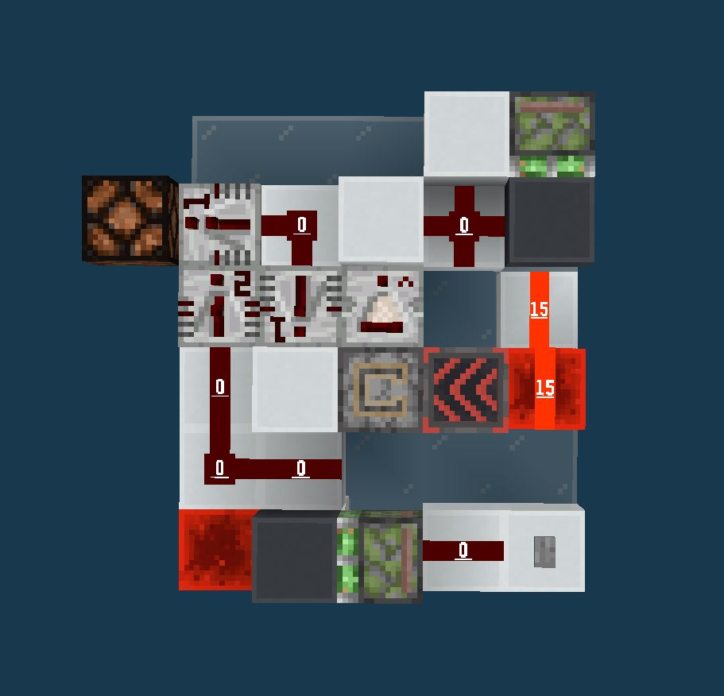
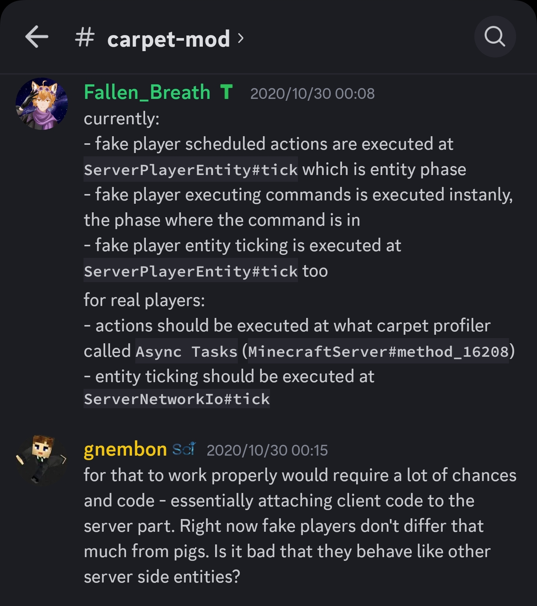

# 堆叠袭击塔对真人适用程度分类

感谢 @何为氕氘氚 和 @Nickid2018 在本文编写过程中提供的帮助。

## 名词定义

- 真人/真玩家: 指通过客户端和网络连接到世界的玩家，单机游戏的玩家也包括在内
- 假人/假玩家: 指使用 carpet mod 的 `/player` 指令生成的玩家
- 本文提到的所有 `网络更新` 阶段实际上应该分为 `网络` 和 `玩家操作` 阶段，但是为了方便理解而统一成一个阶段说明: 
  - `网络` 阶段负责玩家实体的大部分逻辑，例如摔落、水流推动、药水效果等
  - `玩家操作` 阶段负责处理玩家操作，例如攻击、放置方块、使用物品等

## 概述

堆叠袭击塔对于玩家操作的接受程度可以分成以下四类: 
1. 需要在 `实体更新` 阶段的玩家行为 / 机器时序依赖假人的特殊性质
2. 需要稳定的玩家行为，要求无网络延迟/不丢包/不掉帧的玩家执行操作
3. 允许玩家操作因为网络延迟存在一定的不精确性
4. 完全不需要玩家操作

\* 不堆叠的袭击塔要是还不支持真人，究竟是什么不可名状的东西

判断方式: 
- 是否需要玩家操作，否，则为 `4.`
- 是否理想化了玩家的操作
  - 否，则为 `3.`
  - 是，则为 `2.`
- 是否仅能使用 `/player` 指令挂机，是，则为 `1.`

## 详细解释

### 1. 需要在 `实体更新` 阶段的玩家行为 / 机器时序依赖假人的特殊性质

正常的玩家行为都在 `网络更新` 阶段执行，但假人和 `/player` 指令却会在 `实体更新` 阶段处理本应该在 `网络更新` 阶段才会处理的玩家行为（关于游戏阶段的介绍请移步 Fallen_Breath 的专栏: [《深度剖析Minecraft #1 游戏流程》](https://www.bilibili.com/read/cv4122124)），这会在很多方面影响到袭击塔的设计: 

  - 不处理袭击招募的情况下，只有假人和 `/player` 指令等在 `袭击运算` 和 `实体更新` 阶段之间的伤害方式可以在合适的时间击杀队长获得不祥之兆。具体微时序分析如下: 
     1. `袭击运算`
        1. 移出距离袭击中心超过112格的袭击怪物
        2. 刷出袭击怪
     2. `实体更新`，按照实体加入维度的顺序运算
        1. 假人比袭击怪先加入维度，因此先处理假人攻击，击杀队长，**获得不祥之兆**
        2. 刚刷出的袭击怪还在袭击中，运算AI，进行袭击招募运算，将其他未死亡的袭击怪物拉回袭击
     3. 之后是 `方块实体` 和 `网络更新` 阶段
  - 假人实体（以及 `/player` 指令控制的任何玩家）和其他实体的交互会受到他们加入世界（生成或者加载）顺序的影响。现在很多袭击塔都使用盔甲架来检测玩家的横扫攻击，这一点会影响盔甲架何时弹起。
    - 如果检测用的盔甲架晚于假人实体加入世界，那么盔甲架会在假人动作**同一个 gt 弹起**
    - 如果检测用的盔甲架早于假人实体加入世界，那么盔甲架会在假人动作**之后 1gt 弹起**
  - 因为 `实体更新` 和 `网络更新` 之间还有 `方块实体` 阶段，假人操作也可以影响到一些含有方块实体的电路，例如 [【MC红石】区分玩家和生物的压力板 @Joker_小狼](https://www.bilibili.com/video/BV1as411v7Xn)。取决于袭击塔设计，一些电路有可能出现假人和真人中只有一个能按预期运行的情况。  

另外，除了假人的攻击/使用动作，假人的其他计算也在 `实体更新` 阶段，例如药水效果。而袭击触发靠的是不祥之兆效果自己检测附近有没有村庄区段，当袭击塔的处死方式不是剑横扫而是其他实体（例如 TNT、烟花），就会发生假人比真玩家触发袭击晚 1gt 的情况。微时序分析如下: 

- 假人，单维度: 
  1. GT 0: `实体更新` 阶段
      1. 假人比 TNT/烟花先加入当前维度，假人先计算，但是没有不祥之兆效果所以无事发生
      2. TNT/烟花爆炸，杀死袭击怪，假人**获得不祥之兆效果**
  2. GT 1: `实体更新` 阶段
      1. 计算假人的药水效果，不祥之兆**触发袭击**
- 假人，双维度。主世界刷怪，下界处死: 
  1. GT 0: 
      1. 主世界 - `实体更新` 阶段: 假人计算，但是没有不祥之兆效果所以无事发生
      2. 下界 - `实体更新` 阶段: TNT/烟花爆炸，杀死袭击怪，假人**获得不祥之兆效果**
  2. GT 1: 
      1. 主世界 - `实体更新` 阶段: 计算假人的药水效果，不祥之兆**触发袭击**
- 真玩家，单维度或双维度: 
  1. GT 0: 
      1. 某个维度 - `实体更新` 阶段: TNT/烟花爆炸，杀死袭击怪，玩家**获得不祥之兆效果**
      2. `网络更新` 阶段: 计算玩家的药水效果，不祥之兆**触发袭击**

真玩家和假人在处理动作和计算药水效果之间的相对顺序也不同，真玩家在处理动作之前先计算药水效果，而假玩家在处理动作之后计算药水效果。由 `/player` 指令控制的真人则是前两者的融合: 在 `实体更新` 阶段进行动作，在 `网络更新` 阶段计算药水效果。这三者的微时序分析如下: 

- 真玩家: 
   1. GT 0: `网络更新` 阶段
      1. 计算玩家的药水效果，但是没有不祥之兆效果所以无事发生
      2. 处理玩家动作，击杀队长，**获得不祥之兆效果**
   2. GT 1: `网络更新` 阶段
      1. 计算玩家的药水效果，不祥之兆**触发袭击**
- 假人: 
   1. GT 0: `实体更新` 阶段
      1. 处理假人动作，击杀队长，**获得不祥之兆效果**
      1. 计算假人的药水效果，不祥之兆**触发袭击**
- 由 `/player` 指令控制的真玩家: 
   1. GT 0: `实体更新` 阶段
      1. 处理 `/player` 指令的动作，击杀队长，**获得不祥之兆效果**
   2. GT 0: `网络更新` 阶段
      1. 计算玩家的药水效果，不祥之兆**触发袭击**

Carpet mod 中假人被设计为在 `实体更新` 阶段计算，只是因为作者 gnembon 觉得这样做应该不会有什么问题，但是这种观点在现在看来显然是有问题的:  

### 2. 需要稳定的玩家行为

部分袭击塔的生成平台使用活塞推/拉动地板，在活塞移动的时间内平台没有能够生成袭击队伍的位置。这要求玩家触发袭击的时候避开一些时间段，否则会使很多袭击正好在活塞推拉的时候尝试生成队伍，导致袭击中断。常规的袭击塔中玩家处于村庄区段内，获得不祥之兆效果之后会立即触发袭击，没有限制触发袭击的时刻，假如玩家的攻击间隔出现偏差，就会有上述生成失败的情况发生。

事实上使用 tweakeroo 在本地服务器/单人游戏挂机仍然达不到绝对稳定地操作，这是由 `客户端-服务端` 架构的天然性质决定的。使用本地服务器/单人游戏可用作为判据并不合适，但是我们可以考察设计本身是否理想化了玩家的操作，例如: 在用盔甲架检测横扫时使用侦测器观察绊线 + T触发器，这是对玩家攻击间隔的理想化，它假定了玩家不会在第一次挥剑之后 11~14gt 内再次挥剑，没有考虑侦测器在侦测到方块状态变化后 4gt 内是无法再次侦测的。

### 3. 允许玩家操作因为网络延迟存在一定的不精确性

解决了 `类别2` 中存在的问题后即是此类。这并不意味着真玩家挂机与假人挂机效率一定相同。因为袭击塔的效率与单位时间内触发的袭击数量相关，而触发袭击又需要玩家先击杀袭击队长获得不详之兆效果，当玩家因为卡顿错过了几次攻击，袭击塔效率就会降低。

### 4. 完全不需要玩家操作

目前还没有不需要玩家操作的袭击塔，那么为什么会有这个分类呢？只能先写一句敬请期待了 `:P`

 
 
 

堆叠袭击塔对真人适用程度分类 © 2024 作者: Youmiel 采用 CC BY-NC-SA 4.0 许可。如需查看该许可证的副本，请访问 http://creativecommons.org/licenses/by-nc-sa/4.0/。