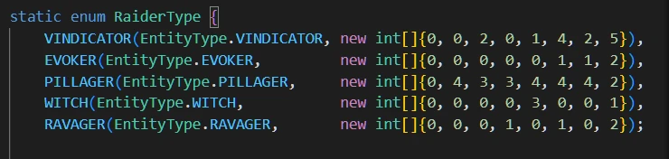
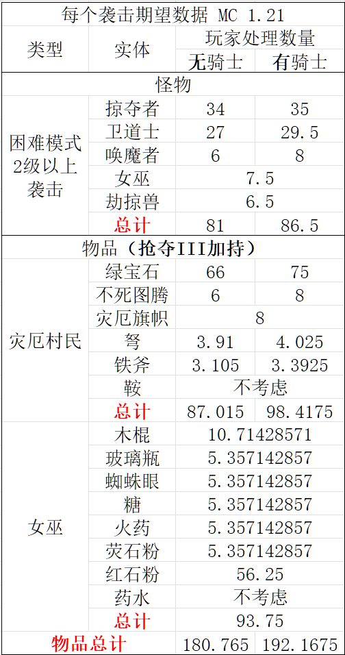

把自己平时零散的研究整合一下，某些我认为像是未定义特性的东西就暂时不写了，免得被修。按照Mojang现在的更新习惯，就算是看上去没什么问题的东西，说不定哪个小版本又改了。

## 2024-06-14 更新, MC 1.21

1. 不详之瓶的掉落条件是<不在袭击中(指没有RaidID)>并且是<袭击队长>的<掠夺者>，卫道士不能掉落不详之瓶；

2. 并不是每次袭击（指包括全部波数的袭击事件）都能掉落不详之瓶，在一波怪物中，卫道士早于掠夺者生成，假如某波怪中包含卫道士，那么掠夺者不可能会是队长。按照代码定义，每波怪物的基础组成如下。大于1级的不祥之兆刷出的额外波大致是<当前难度下>的最后一波怪物组成，具体情况在当前主题下不重要：

3. 在每波怪物中会额外生成一些卫道士和掠夺者，其中简单和普通难度可能生成 0\~1 卫道士（简单难度随机到 0 的概率更大），困难难度可能生成 0\~2 卫道士，所以 (2) 中有潜力的 1、3 两波也不是必然刷出是掠夺者的队长。

4. 袭击迁移机制没有改动。

目前用丐版袭击塔试下来的感觉是经常会遇到不详之瓶入不敷出的情况，达到自循环相当困难。可能的解决方法：

1. 专门改造前哨站来获取不详之瓶

2. 利用袭击怪会主动捡旗帜补上队长空位的AI来把卫道士队长替换成掠夺者队长，由于 MC-247440 还没修，难度进一步增加

## 2024-06-28 更新, MC 1.21

1. 不详之瓶仅能由掠夺者掉落确定为有意设计的特性(Work As Intended, WAI)，相关bug报告 MC-270014 处理结果为 WAI(https://bugs.mojang.com/browse/MC-270014)。另外，1.21 更新日志中写的是“Ominous Bottles can be found uncommonly in any Vaults, and are dropped by Raid Captains which are defeated outside a Raid”，与实际情况矛盾，但是 Mojang 似乎并不是很在意(https://bugs.mojang.com/browse/MC-273895)。

## 2024-07-04 更新, MC 1.21

1. 不祥之兆在当前位置处于一个5级袭击范围内的时候不会转变成袭击之兆。

2. 掠夺者小队长掉落不详之瓶的等级在 1\~5 内随机，各等级掉落概率相同。

## 2024-07-09 更新, MC 1.21

1. 客户端长按使用物品由两个网络包控制：
   - ServerboundUseItemPacket：负责通知服务端玩家何时开始使用物品
   - ServerboundPlayerActionPacket：当 action 字段为 RELEASE_USE_ITEM 或者 SWAP_ITEM_WITH_OFFHAND 时，终止玩家使用物品

## 2024-08-14 更新, MC 1.21

1. MC 1.21 中，每波袭击的产物期望是 180.765（不处理骑士）或 192.1675（处理骑士），假设困难难度，袭击等级在2以上，使用抢夺3并且所有怪物都被玩家击杀，不考虑鞍和药水。其中女巫掉落物的期望是 93.75/波，红石粉的期望为 56.25/波。其余内容见表格，数据基于 @何为氕氘氚 在 1.21 前的工作重新计算。

2. 根据前面的数据，可知 1.21 单玩家袭击塔的极限效率在 21691.8/h（无骑士处理） 或 23060.1/h（有骑士处理，以下同理），绿宝石效率 7920/h 或 9000/h，红石效率 6750/h。

## 2024-12-05 更新, MC 1.21.4

总结一下 1.21.2 之后对袭击进行的改动：

1. 袭击刷新区仍然是圆环，但是圆环的半径和圆心偏移量与袭击波次刷新计时（以下用变量 `t` 代称）相关，机制如下：
   1. `t` 每个 gt 减少 1（倒计时），当 `t == 0` 时，刷新袭击队伍，且 `t` 只会被重置为 300
   2. 由 `t` 得到一个缩放倍率 `s = 0.22 * t / 20 - 0.24`
   3. 圆环半径为 `32 * s`，圆心相对于袭击中心在 xz 轴分别的随机偏移量为 `(0 ~ 2) * floor(s)`

2. 每 gt 袭击会在圆环上随机选择刷新点若干次，并检查选中位置是否合适；

3. 如果选中刷新位置不符合以下条件，则重选：
   1. 与袭击中心 y 值差距大于 96
   2. 选中位置是村庄区段且 `t > 140`
   3. 当前位置不能刷怪且下方不是雪片，关于某方块是否可刷怪，参见 [wiki](https://zh.minecraft.wiki/?curid=7615#%E5%8F%AF%E7%94%9F%E6%88%90%E4%BD%8D%E7%BD%AE)
   4. ……（其他不重要的条件，例如区块必须强加载）

4. 在没有找到合适刷怪位置时，每个袭击每 gt 尝试寻找 8 次（1.21.2 前这里是 3 次），如果 `t == 0`，则尝试次数变为 20 × 6 次（1.21.2 前这里是 20 × 4 次）；

5. 次级结论：袭击当前波次因为非死亡原因移出袭击时，接下来刷新的一波（只存在 `t = 0`）会在半径为 7~8 的圆环上。

## 2024-12-29 更新, MC 1.21.4

更正上方 `t = 0` 时的生成尝试次数。

## 2025-04-01 更新, MC 1.21.5

以下是对视频 [MC1.21.2~1.21.4简易自循环袭击塔](https://www.bilibili.com/video/BV1HHZhYGE7U/) 的简要分析：

掠夺者队长掉落不详之瓶只要 96 格内不存在袭击即可，无关队长是否在袭击里；而捡旗帜补位的 AI 行为则需要袭击者确实在袭击中。

上述特性应该从 1.21 开始都生效，具体分析见：[1.21.x 袭击者在 \[96, 112\) 区间内特殊表现的代码分析](../2025-04__1-21_captain_replace/)。

## 2025-08-02 更新，部分（原）秘密特性补充
### 2024-06-28 更新, MC 1.21

不详之瓶无需玩家击杀掠夺者队长即可掉落，摔死/挤压/无源爆炸均可

### 2024-07-06 更新, MC 1.21

Bad Omen 触发为 Raid Omen, 以及 Raid Omen 转变为 Raid 时，会因为在迭代时增删集合而引发 `ConcurrentModificationException`。导致异常发生的那个 gt 后续的状态效果都不会更新。(Credit: Nickid2018, QWERTY770)

### 2024-08-16 更新, MC 1.21.2 快照

[MC-247440](https://bugs.mojang.com/browse/MC-247440) 在事实上已经被修复了，但是 Mojang 只把 [MC-195754](https://bugs.mojang.com/browse/MC-195754) 标记为了“已修复”，不清楚是忘了还是如何。现在 `raidToLeaderMap` 会在队长移出袭击的时候正确更新了。

那么，我曾经构想的借助地狱门传送走袭击队长，让袭击队员捡旗帜来制作队长存储的思路现在可以实现了（还因此产生了 [BV1DL4y1E7nH](https://www.bilibili.com/video/BV1DL4y1E7nH)），或许还能改进成更好的不详之瓶农场。

### 2025-07-24 更新, MC 1.21.5

`ConcurrentModificationException` 在 1.21.5 之后的发生位置与 1.21 ~ 1.21.4 不同，因为 Mojang 修改了一部分状态效果系统的代码。当前版本，在玩家不带有 Raid Omen 但是带有 Bad Omen 的情况下，进入村庄区段会引发 `ConcurrentModificationException` 并导致 Bad Omen 当次移除失败。同样情况下，如果玩家带有 Raid Omen，则 Bad Omen 正常移除，不引发 `ConcurrentModificationException。`

### 2025-08-01 更新, MC 1.21 ~ 1.21.4

1. 1.21 ~ 1.21.4, `ConcurrentModificationException` 除了可以由前述袭击相关状态效果引发外，还可以由伤害吸收制造。具体做法是在伤害吸收效果结束前 1gt 耗尽伤害吸收血量，下个 gt 伤害吸收效果更新时会移除两次（效果耗尽 + 计时结束），代码执行过程中出现了先调用 `HashMap::remove()` 再调用 `Iterator::remove()`，后者执行过程中会因为集合结构被修改而抛出 `ConcurrentModificationException`。

2. 生物（和玩家）身上拥有的状态效果由一个 `HashMap<Holder<MobEffect>, MobEffectInstance>` 存储，但是 Mojang 没有为 `Holder<MobEffect>` 实现 `hashcode()` 方法，且在计算并更新状态效果时直接使用迭代器遍历这个 hashmap。因此，生物的各个状态效果之间的计算顺序并不稳定，每次游戏进程重启、`HashMap` 扩容（扩容节点：状态效果数 12、24，原版状态效果总数不够到下一次扩容）等因素都会改变状态效果的计算顺序。该特性同样适用于 1.21.5 以后的版本，暂不清楚如何有意义地利用。