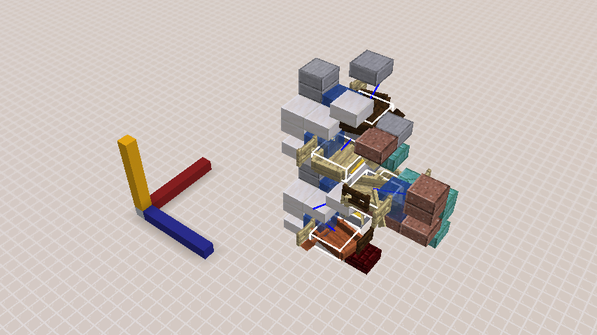

# 代码并非魔法，“手性”却是民科 —— 潜影贝水平旋转对上下船位置的影响

*这篇专栏旨在研究一个 yellowxuuu 于 2022 年 2 月发现的潜影贝特性：[\[MC\] 手 性 潜 影 贝](https://www.bilibili.com/video/BV1LY41157th)。由于该特性发现后多年内并没有公开的、明确的原理解释，导致部分玩家唯现象地理解此特性，明显地误解了其实际机制与出现场景。*


## TL;DR

“手性”实际的原理是潜影贝在乘坐船时，其**水平朝向**（`yaw`属性）会被约束在**相对于船的水平朝向**的 `[-105°, +105°]` 范围内。在“水平朝向”被改变之后，潜影贝的下船方向也随之改变。该机制直到 25w36b 仍然存在，适用于所有类船载具（船、箱船、竹筏），并且可以通过特别构思的结构变换回原始朝向。“手性”用于指代该特性时，容易和它的原意发生混淆，建议换成“隐偏航”（credit: Fallen_Breath）。

*\*希望逐步了解机制挖掘过程、理解相关代码的读者可以直接从下一章节开始阅读；希望了解 yellowxuuu 的装置原理的读者请转到[“九、原装置运作原理分析”](#九原装置运作原理分析)；希望直接获取实践知识的读者请转到[“九、原装置运作原理分析-剩余疑问解答”](#剩余疑问解答)；希望了解这一特性最合适的术语的读者请转到[“十三、如何称呼更恰当”](#十三如何称呼更恰当)*


## 〇、环境准备

如果你还不知道从何处获取源码，但是希望对照本文自行理解的话，可以按照 [1.21.x 袭击者在 \[96, 112\) 区间内特殊表现的代码分析](../2025-04__1-21_captain_replace/2025-04-09__1-21_captain_replace.md) 中的步骤反编译游戏源码。

本文的讲解基于 Minecraft 1.18.1 版本，使用 Yarn 反混淆表。分析过程中有可能涉及断点调试等手段，所以更建议使用 Fabric mod 开发环境。


## 一、名词定义

- **水平旋转/水平朝向**：在这里指实体绕 y 轴旋转的角度，两者含义类似，所以可能会混用。Minecraft 中 y 轴为纵轴，代码中以 `yRot`(Mojang mapping) 和 `yaw`(Yarn mapping) 命名相关的旋转角度。
- **“手性”**：随意命名的特性名词，被 yellowxuuu 用于描述本文中涉及的特性。不清楚是否只有“左”、“右”的区别，仅在涉及原视频或引用他人原话时使用。


## 二、初步分析

根据 [BV1LY41157th](https://www.bilibili.com/video/BV1LY41157th) 中的表现，潜影贝经历了如下几个过程：

1. 生成
2. 第一次上船，从船尾
3. 第一次下船，到左侧或者右侧
4. 连续的几次传送
5. 随机传送到左边的船或者右边的船，从船尾上船
6. 根据其获得的“手性”决定下船之后的位置

首要问题是潜影贝在哪个阶段获得了“手性”。目前看来，不管是左边的潜影贝还是右边的潜影贝都经历了相同的传送过程，传送大概不会影响潜影贝上下船的表现。那么可能的阶段就是 1 、2 或 3。

另外的疑问是，为什么潜影贝下船可以去往不同位置，而下矿车却没听说过类似的特性？为什么第二次上下船没有赋予潜影贝新的“手性”？这是否说明从船尾上船和从左右两侧上船存在不同的性质？假如让左侧的潜影贝第一次下船到船右侧，右侧的潜影贝第一次下船到船左侧，情况又会怎么变化？


## 三、矿车和船下客逻辑差异

查阅 [Minecraft wiki](https://zh.minecraft.wiki)，矿车和船各自的页面中分别描述了两种下客逻辑：

> [矿车](https://zh.minecraft.wiki/w/%E7%9F%BF%E8%BD%A6#%E4%B8%8B%E8%BD%A6)：以右、左、右后、左后、右前、左前、后、前的顺序检查八个水平方向（相对于运动方向）上的相邻方块。然后，如果在与矿车高度相同的相邻位置没有合适的位置，矿车会依次搜索上方一格和下方一格处。对于玩家，矿车会继续检查能容纳爬行的玩家的位置。如果仍然没有找到，矿车会选择自身所在的位置作为生物的下车位置。生物的下车位置被确定后，矿车会将实体传送到该位置的中心处。

> [船](https://zh.minecraft.wiki/w/%E8%88%B9#%E8%A1%8C%E4%B8%BA)：在 Java 版中，下船时的落点由玩家当前视角的水平朝向决定，若玩家所朝方向没有与船紧邻的固体方块，落点为船的正中心位置。

这说明矿车的下客位置由矿车的**运动状态**决定，而船的下客位置由乘客的**水平朝向**决定。船的代码中也印证了这点：

```java
public class BoatEntity extends Entity {
    /* ... */
    public Vec3d updatePassengerForDismount(LivingEntity passenger) {
        Vec3d vec3d = getPassengerDismountOffset((double)(this.getWidth() * MathHelper.SQUARE_ROOT_OF_TWO), (double)passenger.getWidth(), passenger.getYaw());
        // ↑ 根据乘客的水平旋转，计算离开船时需要的偏移量
        double d = this.getX() + vec3d.x;
        double e = this.getZ() + vec3d.z;
        BlockPos blockPos = new BlockPos(d, this.getBoundingBox().maxY, e);  // 预定的位置 1
        BlockPos blockPos2 = blockPos.down();  // 预定的位置 2
        if (!this.world.isWater(blockPos2)) {
            /* 判断下船的位置是否符合下船条件, 略 */
        }
        return super.updatePassengerForDismount(passenger);
        // ↑ 调用父类方法，也就是将乘客放置在自身包围盒上表面中心位置
    }
   /* ... */
}
```

在 fabric mod 开发环境中下断点，可以看到潜影贝下船时的调用栈：

```
BoatEntity.updatePassengerForDismount(LivingEntity)
LivingEntity.onDismounted(Entity)
LivingEntity.stopRiding()
ShulkerEntity.stopRiding()
Entity.removeAllPassengers()
BoatEntity.tick()
...
```

上述代码和调用栈中，只是使用了乘客的水平朝向，并没有修改它，说明是其他位置修改了水平朝向，后面需要重点关注的就是影响水平朝向的因素。


## 四、生物旋转属性梳理

`Entity` 类中：
```java
private float yaw;
private float pitch;
public float prevYaw;
public float prevPitch;
```

`LivingEntity` 类中：
```java
public float bodyYaw;
public float prevBodyYaw;
public float headYaw;
public float prevHeadYaw;
// 还有一些不直接影响姿态的属性，不列出
```

可以发现，潜影贝从父类得到了三个水平旋转的属性，它们的含义分别是：
- `yaw`: 所有实体都有的水平旋转，包括木船、物品实体等非生物；
- `bodyYaw`: 生物身体的水平旋转，通常由生物的 `tick()` 或者 AI 控制代码中与 `yaw` 同步，但是存在例外；
- `headYaw`: 生物头部的水平旋转。


## 五、排除干扰

### 传送是否影响水平旋转

保险起见，先检查一下潜影贝传送是否影响水平旋转，避免对后续分析产生干扰。

```java
public class ShulkerEntity extends GolemEntity implements Monster {
    /* ... */
    protected boolean tryTeleport() {
        if (!this.isAiDisabled() && this.isAlive()) {
            BlockPos blockPos = this.getBlockPos();

            for(int i = 0; i < 5; ++i) {
                BlockPos blockPos2 = blockPos.add(MathHelper.nextBetween(this.random, -8, 8), MathHelper.nextBetween(this.random, -8, 8), MathHelper.nextBetween(this.random, -8, 8));
                if (blockPos2.getY() > this.world.getBottomY() && this.world.isAir(blockPos2) && this.world.getWorldBorder().contains(blockPos2) && this.world.isSpaceEmpty(this, (new Box(blockPos2)).contract(1.0E-6))) {
                Direction direction = this.findAttachSide(blockPos2);
                    if (direction != null) {
                        this.detach();  // 脱离所有乘客和载具，不在讨论的涉及的情况内
                        this.setAttachedFace(direction);  // 修改附着朝向，是独立属性，不影响水平旋转
                        this.playSound(SoundEvents.ENTITY_SHULKER_TELEPORT, 1.0F, 1.0F);
                        this.setPosition((double)blockPos2.getX() + 0.5, (double)blockPos2.getY(), (double)blockPos2.getZ() + 0.5);  // 修改位置，不影响水平旋转
                        this.dataTracker.set(PEEK_AMOUNT, (byte)0);  // 修改外壳开启的程度
                        this.setTarget((LivingEntity)null);
                        // ↑ 修改仇恨目标，大部分仇恨相关 AI 仅使用 LookControl，修改的是 headYaw 而不是 yaw
                        return true;
                    }
                }
            }

            return false;
        } else {
            return false;
        }
    }
    /* ... */
}
```

### 潜影贝 AI 是否影响水平旋转

既然前面遇到的潜影贝 AI 部分涉及了视线控制（`LookControl`），那就顺便看一下身体控制（`BodyControl`），常规生物 AI 会在这部分修改水平旋转以配合移动和寻路。潜影贝使用的是特殊的 `ShulkerEntity.ShulkerBodyControl`，代码如下：

```java
static class ShulkerBodyControl extends BodyControl {
    public ShulkerBodyControl(MobEntity mobEntity) {
        super(mobEntity);
    }

    @Override
    public void tick() {
    }
}
```

没错，是空的，也就表示潜影贝的 AI 无法对它的水平旋转造成任何影响。同时，潜影贝的 `yaw` 和 `bodyYaw` 也被解耦，不会同步。（注：潜影贝的 `tick()` 中也不存在修改水平旋转的代码）


## 六、潜影贝自身代码如何处理水平朝向

前文提过的几点不再赘述，下面还有几处设置水平朝向的代码：

```java
public class ShulkerEntity extends GolemEntity implements Monster {
    /* ... */
    @Override
    public void stopRiding() {
        super.stopRiding();
        if (this.world.isClient) {
            this.prevAttachedBlock = this.getBlockPos();
        }
        // ↓ 脱离载具时将 bodyYaw 设置成 0，但是不影响 yaw
        this.prevBodyYaw = 0.0F;
        this.bodyYaw = 0.0F;
    }

    @Override
    public EntityData initialize(
        ServerWorldAccess world, LocalDifficulty difficulty, SpawnReason spawnReason, @Nullable EntityData entityData, @Nullable NbtCompound entityNbt
    ) {
        // ↓ 生成时将 yaw 设置成 0
        this.setYaw(0.0F);
        this.headYaw = this.getYaw();
        this.resetPosition();
        return super.initialize(world, difficulty, spawnReason, entityData, entityNbt);
    }

    @Override
    public void updateTrackedPositionAndAngles(double x, double y, double z, float yaw, float pitch, int interpolationSteps, boolean interpolate) {
        this.bodyTrackingIncrements = 0;
        this.setPosition(x, y, z);
        // ↓ 网络相关的代码，同步旋转属性
        this.setRotation(yaw, pitch);
    }

    @Override
    public void readFromPacket(MobSpawnS2CPacket packet) {
        super.readFromPacket(packet);
        // ↓ 客户端处理潜影贝生成的网络包时将 bodyYaw 设置成 0
        this.bodyYaw = 0.0F;
        this.prevBodyYaw = 0.0F;
    }
    /* ... */
}
```
```java
public abstract class LivingEntity extends Entity {
    /* ... */
	protected LivingEntity(EntityType<? extends LivingEntity> entityType, World world) {
		super(entityType, world);
        /* ...其他无关的初始化逻辑... */
		this.setYaw((float)(Math.random() * (float) (Math.PI * 2)));    // 将 yaw（单位是角度）设置为 [0.0f, 2 * PI) 中的随机值
		this.headYaw = this.getYaw();
        /* ...其他无关的初始化逻辑... */
	}
    /* ... */
}
```

不难发现，以上代码不是初始化，就是处理客户端-服务端之间的同步逻辑，没有在后续改变水平朝向。

值得注意的是在 `LivingEntity` 构造器中，生物的水平朝向被初始化为 `[0.0f, 2 * PI)` 中的随机值，但是这一属性是按照角度来使用的，这就导致大部分生物被创建时会大致朝向 +z 方向而不是别的方向。对于潜影贝来说，`/summon` 命令、刷怪蛋生成会调用 `ShulkerEntity.initialize(...)` 方法，水平旋转严格为 `0.0f`；而末地城连带生成、因潜影弹击中而生成的潜影贝不会调用 `ShulkerEntity.initialize(...)` 方法，水平旋转为 `[0.0f, 2 * PI)` 中的随机值。


## 七、乘客上船时是否会改变水平朝向

对 `ShulkerEntity.startRiding(Entity, boolean)` 下断点，调用栈如下：

```
MobEntity.startRiding(Entity,boolean)
ShulkerEntity.startRiding(Entity,boolean)
Entity.startRiding(Entity)
BoatEntity.tick()
```

其中比较有实际内容的 `ShulkerEntity.startRiding(Entity,boolean)` 和 `MobEntity.startRiding(Entity,boolean)` 如下：

```java
// ShulkerEntity
public boolean startRiding(Entity entity, boolean force) {
    if (this.world.isClient()) {
        this.prevAttachedBlock = null;
        this.teleportLerpTimer = 0;
    }
    // ↓ 设置附着朝向
    this.setAttachedFace(Direction.DOWN);
    return super.startRiding(entity, force);
}
```
```java
// MobEntity
public boolean startRiding(Entity entity, boolean force) {
    boolean bl = super.startRiding(entity, force);
    if (bl && this.isLeashed()) {
        this.detachLeash(true, true);
    }  // ↑ 解除拴绳

    return bl;
}
```

这说明潜影贝上船的时候也没有直接改变水平朝向。排除掉上船、下船和潜影贝自己计算时朝向发生变化的可能性，那只有可能是船改变了潜影贝的水平朝向。


## 八、船是如何改变潜影贝水平朝向的

要找到潜影贝的水平朝向被改变的时刻，最便捷的方法是对 `Entity.setYaw(float)` 下条件断点，让它在改变潜影贝水平朝向的时候触发。


在 yellowxuuu 的示例存档中，潜影贝经过右侧装置后的水平旋转是 `-71.450195f`，那就使用条件表达式 `this instanceof net.minecraft.entity.mob.ShulkerEntity && yaw > -72 && yaw < -71`。触发断点时的调用栈：

```
Entity.setYaw(float)
BoatEntity.copyEntityData(Entity)
BoatEntity.updatePassengerPosition(Entity)
Entity.tickRiding()
LivingEntity.tickRiding()
ServerWorld.tickPassenger(Entity,Entity)
ServerWorld.tickEntity(Entity)
```

这非常符合前面的猜测。`BoatEntity.updatePassengerPosition(Entity)` 顾名思义包含了船更新乘客位置的逻辑，事实上也是这样。`BoatEntity.copyEntityData(Entity)` 就比较诡异了，对照 Mojang mapping，它的命名是 `clampRotation(Entity)`，意思是限制乘客的旋转角度，更符合这个方法的内容：

```java
public class BoatEntity extends Entity {
    /* ... */
    // clampRotation (Mojang mapping)
	protected void copyEntityData(Entity entity) {
		entity.setBodyYaw(this.getYaw());
        // ↓ 计算从船的水平朝向到乘客的水平朝向的角度差，取值范围限制在 [-180.0f, 180.f)
		float f = MathHelper.wrapDegrees(entity.getYaw() - this.getYaw());
		float g = MathHelper.clamp(f, -105.0F, 105.0F);  // 限制角度差到 [-105.0f, 105.0f]

        // ↓ 如果 g - f == 0，说明前面的角度差没有超出范围，无需调整
		entity.prevYaw += g - f;
		entity.setYaw(entity.getYaw() + g - f);  // 调整乘客的水平朝向
		entity.setHeadYaw(entity.getYaw());
	}
    /* ... */
}
```

正是这个方法改变了潜影贝的水平朝向，正好潜影贝的计算逻辑里不主动改变水平朝向，这个被改变的值才能一直留到下船的时候，表现为下船位置的差异。


## 九、原装置运作原理分析

首先了解一下 Minecraft 的坐标系统。y 轴向上，左手系，实体水平旋转为 0 时朝向 z 轴正方向。图中红、黄、蓝分别表示 x、y、z 三轴，和 F3 屏一致，后面截图时都会带上坐标参考。


### 1. 潜影贝第一次上船


两艘船均朝向 -z 方向，左边装置的船，水平旋转为 `175.99316f`，右边装置的船，水平旋转为 `-176.4502f`。潜影贝从左边装置上船后的水平旋转被调整为 `70.993164f`，朝 -x 方向下船；从右边装置上船后的水平旋转被调整为 `-71.450195f`，朝 +x 方向下船。与代码中发现的 `[-105.0f, 105.0f]` 角度差符合，与乘客下船的机制也符合。


### 2. 潜影贝通过脚手架通道连续传送


查阅代码已经验证，传送不影响潜影贝的水平朝向。

### 3. 潜影贝第二次上船


两艘船均朝向 -z 方向，左边装置的船，水平旋转为 `176.15292f`，右边装置的船，水平旋转为 `-177.74106f`。

来自下层左侧船、具有 +70 左右水平旋转的潜影贝，经过左边的装置，水平旋转变为 `71.15292f`，朝 -x 方向下船，之后传送到左边平台；经过右边的装置，水平旋转变为 `77.25894f`，尝试朝 -x 方向下船，但是对应方向没有合适的落脚点，所以落在船顶部，**如果之后随机传送到左侧装置，则能朝 -x 方向正常下船**。

来自下层右侧船、具有 -70 左右水平旋转的潜影贝，经过右边的装置，水平旋转变为 `-72.74106f`，朝 +x 方向下船，之后传送到右边平台；经过左边的装置，水平旋转变为 `-78.84708f`，尝试朝 +x 方向下船，但是对应方向没有合适的落脚点，所以落在船顶部，**如果之后随机传送到右侧装置，则能朝 +x 方向正常下船**。

因此，第二层船没有大幅改变潜影贝的水平旋转，更多的是起到筛选作用，只要船的方向大致朝 -z 方向，就能将两类水平旋转情况的潜影贝左右分开。左右镜像的装置可以合并，并且仍旧正常工作，如下图：


### 剩余疑问解答

在[文章的一开始](#初步分析)，提出了针对这个现象的一系列疑问，现在知晓了原理，可以对未解答的疑问做出解释。

#### Q: 为什么潜影贝下船可以去往不同位置，而下矿车却没听说过类似的特性？

A: [“三、矿车和船下客逻辑差异”](#三矿车和船下客逻辑差异)中已对这个问题作出过回答。

#### Q: 为什么第二次上下船没有赋予潜影贝新的“手性”？

A: 实际上，潜影贝第二次上船后仍然会被船改变水平朝向，但是由于两次上的船朝向相近，潜影贝的水平朝向改变不大；或者正好在允许的范围内，没有发生改变，因此下船方向看起来没有变化。

#### Q: 这是否说明从船尾上船和从左右两侧上船存在不同的性质？

A: [“七、乘客上船时是否会改变水平朝向”](#七乘客上船时是否会改变水平朝向)中已经确认过，上船的逻辑不改变乘客的水平朝向，所以从哪一个方向上船没有任何影响。

#### Q: 假如让左侧的潜影贝第一次下船到船右侧，右侧的潜影贝第一次下船到船左侧，情况又会怎么变化？

A: 如果说“下船到船某侧”指的是把落脚方块换一个位置，那么除了潜影贝第一次下船会落到船正上方，水平朝向的变化量和第二次下船的位置都不会变。如果说“下船到船某侧”指的是调整船的朝向，让潜影贝换个水平朝向，那么潜影贝最终会分别转移到对角的平台而不是同一侧的平台。


## 十、被曲解的“手性”

yellowxuuu 的视频中只是演示了分离装置并用“手性”来解释这一现象，没有对“手性”作更深入的解释。但是玩家社区在多年的潜影贝农场设计实践中，仅凭猜测去补充该现象的规律、产生条件等，最终导致这个特性被加入了许多毫无根据的描述。

> **手性**
> 
> 当潜影贝在生成后第一次乘坐船时，根据其下船方向的不同，会得到一个向左或向右的手性。
> 
> 第一次下船时附着于船左侧方块的潜影贝会得到向左的手性，再次乘坐船时仅能从左侧下船，反之亦然。若手性对应侧没有合适的方块，潜影贝将停留在船所处的方块上。
> 
> 潜影贝的手性一经决定便无法更改，但由已有手性的潜影贝复制而来的潜影贝没有手性。
>
> —— Minecraft wiki [潜影贝#手性 (由用户 Fight xing​ 编辑)](https://zh.minecraft.wiki/w/%E6%BD%9C%E5%BD%B1%E8%B4%9D?oldid=1019784#%E6%89%8B%E6%80%A7)

接下来本章节将逐一列举引用段落中出现的错误，并予以修正。

### “……根据其下船方向的不同，会得到……”

据[前面的分析](#九原装置运作原理分析)，潜影贝下船的位置由它的水平朝向决定，而水平朝向如何改变由船和潜影贝之间的相对旋转决定。

也就是说，并不是潜影贝下船到哪个方向赋予了它“手性”，而是它的“手性”决定了它从哪个方向下船，和船周围的环境无关，就算它下船到船正上方，被解释为“手性”的水平朝向也早在船上的时候就被修改了。

### “……向左或向右的手性……”

“手性”背后的实际属性是实体的水平旋转，而这个属性的取值范围通常是 `[-180.0f, 180.f)`。就算被船的相对旋转范围限制，`[-105.0f, 105.0f]` 的范围也能对应七个下船位置，其中还包括“向前”这样不属于左或右的方向。

### “……再次乘坐船时仅能从 x 侧下船……”

如[“三、矿车和船下客逻辑差异”](#三矿车和船下客逻辑差异)所述，乘客下船到何处看的是乘客的水平朝向，而不是船的左右侧。举个简单的例子：水平朝向为 0 （+z 方向） 的潜影贝乘坐上朝向为 -170 （-z 偏 +x）的船后，水平朝向变为 65（+x +z 方向），从右侧下船。再让它乘坐上朝向为 0 （+z 方向）的船后，自身水平朝向不变，但是相对于船则是从船左侧下船。

### “……潜影贝的手性一经决定便无法更改……”

既然潜影贝的水平朝向是被船限制乘客朝向的代码改变的，那么只要潜影贝再乘坐一次相对旋转差值大于 105 的船，它的水平朝向就能再次改变。


## 十一、恢复原始水平朝向

下图是一种将任意水平朝向的潜影贝逐步调整回 +z 朝向（水平旋转为 0 时的朝向）的原型装置，设计版本为 1.18.1。只保证朝向相同，不保证 `yaw` 的数值相等，有可能是 `360.0f`, `-360.0f` 等数字。红色下界砖为潜影贝初始位置。

几艘船的水平朝向从下至上依次是：
- （金合欢木船）任意，模拟潜影贝被随机旋转的状况
- 115
- 45
- -25
- -95
- （深色橡木木船）-105



如果允许玩家参与，更简单的办法是由玩家操控船向任意方向旋转 360°，再顺势旋转到 `yaw` 等于 105.0f 或 -105.0f。


## 十二、更新的版本是否存在这个特性

存在，目前看来直到 25w36b，产生核心影响的代码没有改动。另外，该特性适用于所有新加入的类船载具（竹筏、运输船、运输竹筏）。


## 十三、如何称呼更恰当？

这个特性实际上只是“潜影贝在乘坐船时，其水平朝向会被船的朝向所限制和调整”，并没有独立的、不可更改的属性。用“手性”来描述，不仅容易让人误解为一种二元、不可逆的状态，还可能掩盖了其本质是“水平朝向”这一连续变量的事实。

更何况“手性”作为一个专业名词，广泛用于科教领域，随意借用还容易混淆该词的含义。

因此，建议使用“隐偏航”描述这一机制（credit: Fallen_Breath），既提及了“水平旋转”的属性，又暗示了这个属性的改变是不对外展现的。在具体讨论机制时，直接使用属性原名“水平朝向”、`“yaw”` 或者 `“yRot”` 更佳，既能避免歧义，也方便与代码和游戏机制对应。

总之，希望本文的分析能为相关讨论提供参考。


<br>
<br>
<br>
<br>

"潜影贝水平旋转对上下船位置的影响" © 2025 作者: Youmiel 采用 CC BY-NC-SA 4.0 许可。如需查看该许可证的副本，请访问 http://creativecommons.org/licenses/by-nc-sa/4.0/。