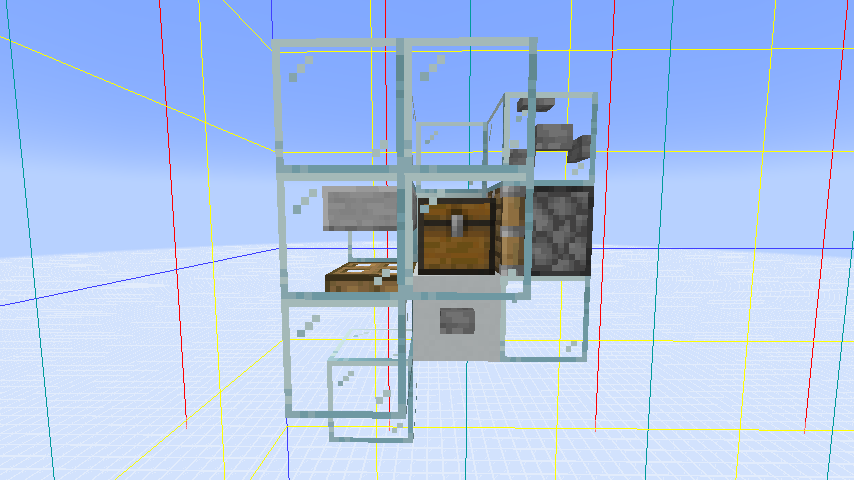
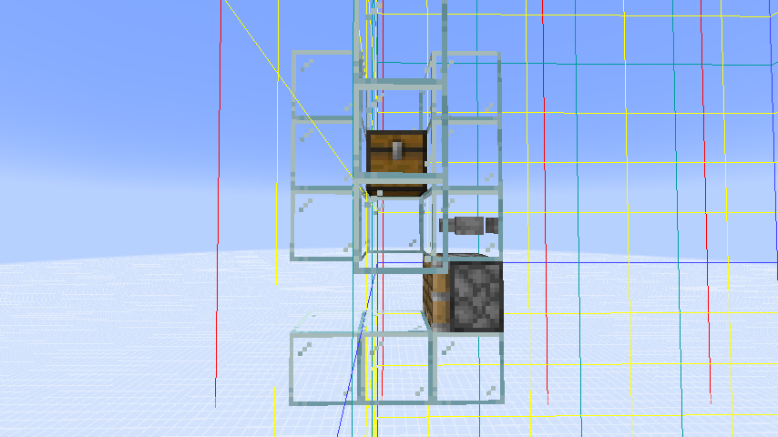
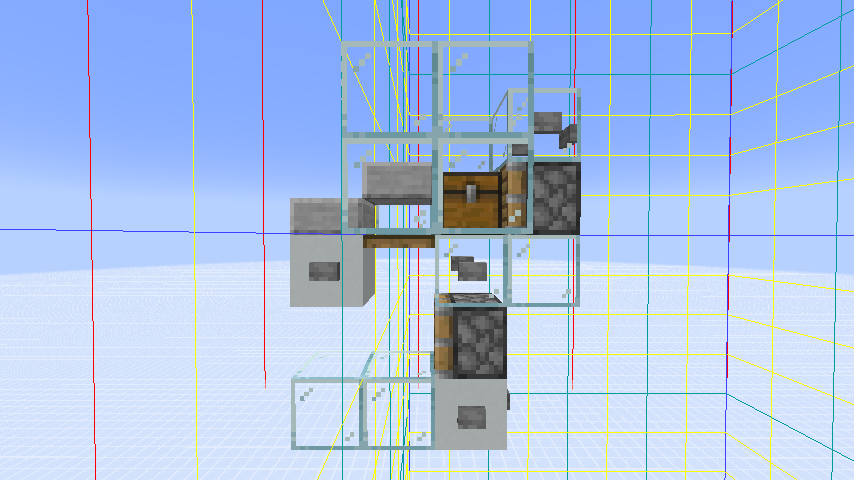
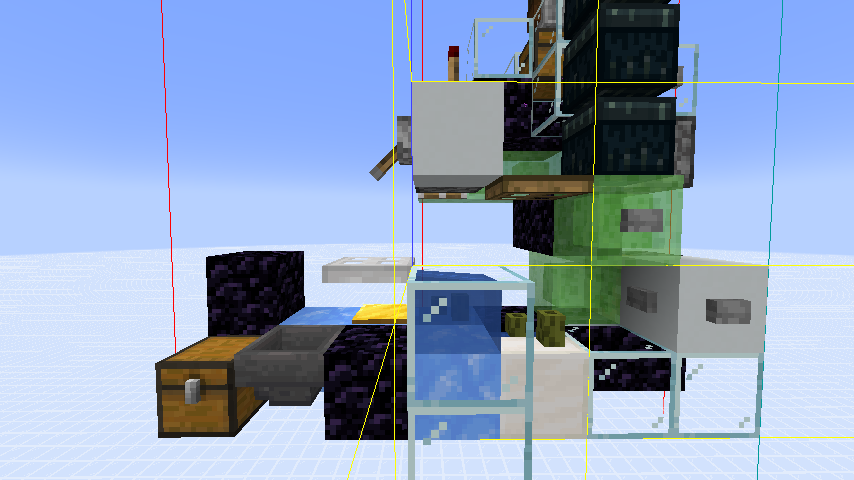
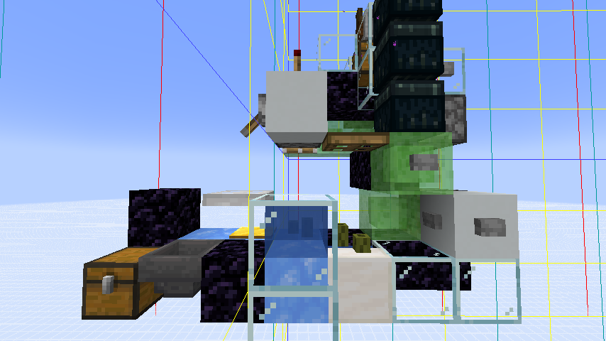
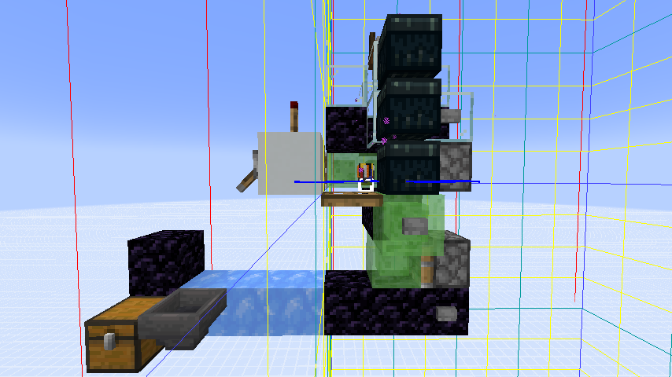
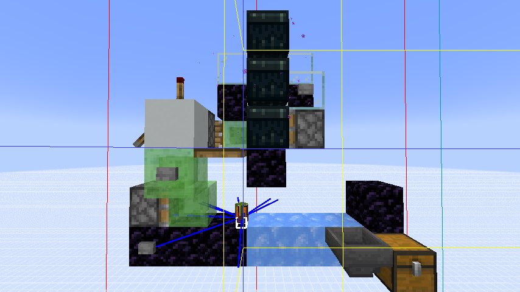
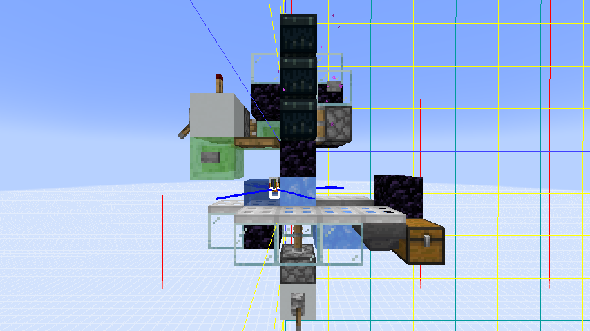
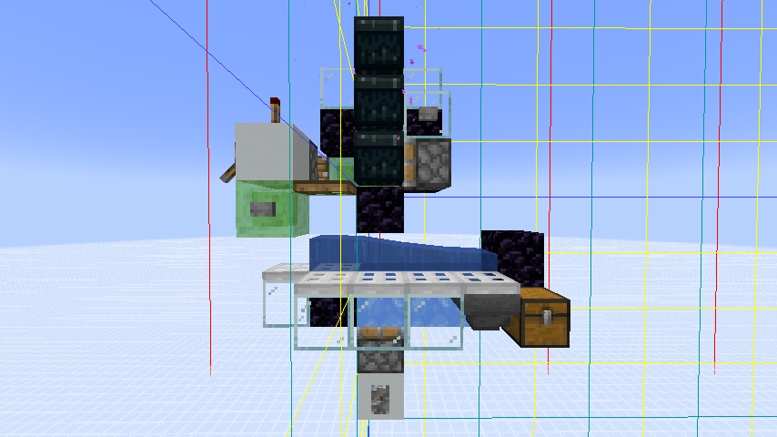

# 物品实体跨越区段补充实验

这是对主文《[仅仅是跨越区段，分离的顺序却离了谱 —— 自底向上理解物品实体跨越区段的特性](2026-01__subchunk_split.md)》的补充实验记录，旨在验证主文中的分析。

## 实验环境

- Minecraft Java 版本 1.18.2（鉴于“模 4”特性在 1.14+ 版本中广泛存在，范围内的游戏版本都应该能复现）
- 带有复现装置的[创造模式存档](2026-01-05_ItemSplit.zip)
- 装有命名为 `1` 至 `8` 的各色羊毛的箱子
- 通过翻译文本资源包重命名各色羊毛为 `1` 至 `8`，方便辨识，存档内附带

## 实验项目

- 测试**弹射式堆分离顺序**的方法：在冰道末尾放置漏斗，连接空箱子，观察物品进入箱子的顺序。
- 测试 **AABB 选择顺序**的方法：漏斗吸取，观察物品进入箱子的顺序；命令 `/say @e[distance=..10, type=item]`，观察物品实体名字的输出顺序。
    - 初始状态的输出均为 1, 2, 3, 4, 5, 6, 7, 8

### 1. 打开活板门使物品落入下个区段

输出: 1, 5, 4, 8, 3, 7, 2, 6

- 用于验证测试命令的准确性，结果符合预期。

### 2. 直接用活塞将生成的物品横推到相邻区段

输出: 1, 2, 3, 4, 5, 6, 7, 8

- 验证 B36 推动是否会打乱物品实体进入区段的顺序，结果是不会。

### 3. 打开活板门使物品落入下个区段 - 横推到相邻区段

输出（落入下个区段）: 4, 8, 3, 7, 2, 6, 1, 5

输出（横推至相邻区段）: 4, 8, 3, 7, 2, 6, 1, 5

- 说明 B36 推动能够保留物品（分批）进入区段的顺序。

### 4. 本区段归中 - 弹射式堆分离

输出（归中后）: 1, 2, 3, 4, 5, 6, 7, 8

输出（堆分离）: 1, 2, 3, 4, 5, 6, 7, 8

- 确认弹射式堆分离的输出符合预期。

### 5. 归中 - 打开活板门使物品落入下个区段 - 弹射式堆分离

输出（落入下个区段）: 4, 8, 3, 7, 2, 6, 1, 5

输出（堆分离）: 1, 2, 3, 4, 5, 6, 7, 8

- 说明弹射式堆分离的输出固定为物品创建顺序，无关物品进入区段的顺序。

### 6. 归中 - 打开活板门使物品落入下个区段 - 物品距离区段边界 0.875 格 - 横向弹出到相邻区段后用漏斗吸取

输出（落入下个区段）: 3, 7, 2, 6, 1, 5, 4, 8

输出（横向弹出）: 1, 2, 3, 4, 5, 6, 7, 8

- 说明这种弹射情况，物品跨越区段**依靠的是自主移动**而非 B36 推动，B36 在第二个 tick 时**没有接触**到物品实体。

- 说明物品堆高速移动进入区段的顺序与物品创建顺序一致，无关物品进入区段的顺序。

### 7. 归中 - 打开活板门使物品落入下个区段 - 物品距离区段边界 0.125 格 - 横向弹出到相邻区段后用漏斗吸取

输出（落入下个区段）: 1, 5, 4, 8, 3, 7, 2, 6

输出（横向弹出）: 1, 5, 4, 8, 3, 7, 2, 6

- 说明这种弹射情况，物品跨越区段**依靠的是 B36 推动**而非自主移动，B36 在第二个 tick 时**才接触**到物品实体。

- 说明粘液块弹射以特定模式处于区段边界的时候，无法将物品实体进入区段的顺序恢复为创建顺序。

### 8. 归中 - 打开活板门使物品落入下个区段 - 物品距离区段边界 0.125 格 - 水流冲到相邻区段后用漏斗吸取（一开始水不流动）

输出（落入下个区段）: 2, 6, 1, 5, 4, 8, 3, 7

输出（水流末端）: 1, 2, 3, 4, 5, 6, 7, 8

- 说明除了粘液块弹射以外，水流也可以使物品实体按照创建顺序自主移动。

### 9. 归中 - 打开活板门使物品落入下个区段 - 物品距离区段边界 0.125 格 - 水流冲到相邻区段后用漏斗吸取（一开始就是流动水）

输出（水流末端）: 2, 6, 1, 5, 4, 8, 3, 7

- 说明物品经过区段分批之后，如果没有重新聚集，每批之间的间距足以使物品进入其他区段的时机不同。

 
 
 
 
"物品实体跨越区段补充实验" © 2026 作者: Youmiel 采用 CC BY-NC-SA 4.0 许可。如需查看该许可证的副本，请访问 http://creativecommons.org/licenses/by-nc-sa/4.0/。