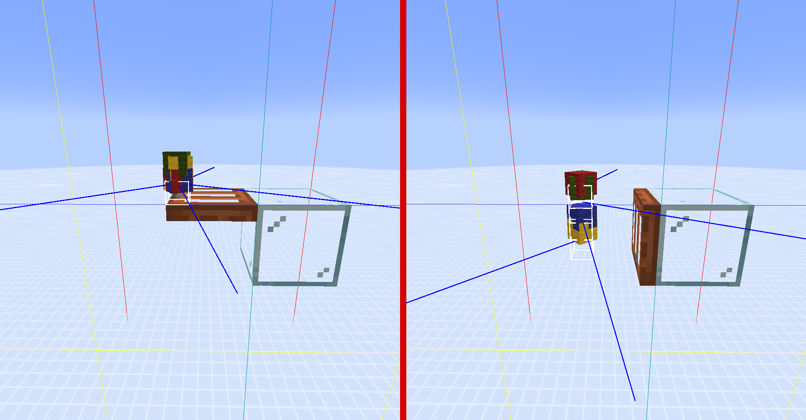

# 仅仅是跨越区段，分离的顺序却离了谱 —— 自底向上理解物品实体跨越区段的特性

这篇专栏旨在从代码层面，深入浅出地分析物品实体跨越区段导致的各种顺序问题，重新解析 AndrewsTechMC (andrews54757) 的 [快速物品合成系统](https://www.bilibili.com/video/BV1Vr4y1p7j7) 核心原理，解释 [慕斯丶白](https://space.bilibili.com/8134012)、[Gufen](https://space.bilibili.com/650610115) 近期观察到的现象 [《子区块对堆分顺序和吸取顺序影响测试（多方面测试）》](https://www.bilibili.com/opus/1148372975387410489)，并且纠正技术社区常见的一些误解，包括“出入区段能重置实体ID”、“物品实体 NBT 数据中 `Age` 属性会影响分离的顺序”。

由于 Mojang 在 2025 年 10 月 29 日已经宣布从 `26.1-snapshot-1` 版本开始不再混淆 Java 版 Minecraft 的代码，并且公开了 `25w45a` 至 `1.21.11` 之间的未混淆核心文件，因此本文中涉及的代码片段均使用 Mojang Mapping，便于读者理解。

## 一、前置知识

为了让专栏结构尽量精简，常规技术知识在此不一一解释。

### 子区块合成系统相关知识

如果你需要掰开揉碎、适合从零开始学习子区块合成系统的版本，可以观看 [胖纸wzh (wawuli)](https://space.bilibili.com/510518718/) 的视频:

- [BV1r1421b7dJ](https://www.bilibili.com/video/BV1r1421b7dJ)
- [BV1ST421k7iN](https://www.bilibili.com/video/BV1ST421k7iN)
- [BV1P1421t7nk](https://www.bilibili.com/video/BV1P1421t7nk)
- [BV1YE4m1R78V](https://www.bilibili.com/video/BV1YE4m1R78V)
- [BV1GhYsevE6o](https://www.bilibili.com/video/BV1GhYsevE6o)

或者阅读文字版本:
[[留档]子区块合成系统视频文案](https://www.bilibili.com/opus/993741954979201032)

### 物品堆分离相关知识

- [\[沙雕红石\]一台不知道有什么用的机器...（BV1DP4y1p7E9）](https://www.bilibili.com/video/BV1DP4y1p7E9)
- [堆叠物品分离【\_MethodZz\_】（BV1Cb4y1y7Nj）](https://www.bilibili.com/video/BV1Cb4y1y7Nj)
- [[Minecraft]喂饭式の物品分离（堆分离）原理讲解/教程（BV1Sw411w7dp）](https://www.bilibili.com/video/BV1Sw411w7dp)

另外，使用预填充的漏斗矿车 + 烧车也可以实现堆分离，与前者结果相同而原理不同，这一点会在后续的分析中提及。***\[需要引用\]***

### 物品实体相关代码术语

请参考 [附录：来自 Andrews54757 的术语解释（Gufen翻译）](#附录来自-andrews54757-的术语解释gufen翻译)

## 二、实体计算、选择涉及的数据结构

深究原理，不可避免地需要了解一些数据结构和代码实现细节，不过我会尽量用通俗的语言来解释。

`ServerLevel` 是实现维度计算逻辑的核心类，其中包含了多个重要的数据结构：

- `EntityTickList entityTickList`: 当前维度中所有需要被更新的实体列表
- `PersistentEntitySectionManager<Entity> entityManager`: 用于存储和管理当前维度中的实体

### `EntityTickList entityTickList`

在维度的每个游戏刻更新过程中，会遍历 `entityTickList`，依次调用其中每个实体的 `Entity::tick()` 方法来更新实体状态，**也就是技术社区常说的 EU（Entity Update，实体更新）阶段**。

实体的更新顺序取决于 `EntityTickList` 类的遍历顺序，它的内部包含若干个 `Int2ObjectLinkedOpenHashMap`，主要是确保遍历过程中不制造未定义行为，实际遍历的只有一个 `Int2ObjectLinkedOpenHashMap`。而这个 map 以实体 ID 为键、实体对象为值，并且遍历顺序固定为**元素加入顺序**。

实体 ID 是在实体生成时分配的，且有别于 UUID，每次生成的实体 ID 都比上一个生成的实体 ID 大 1。实体生成后会被加入 `entityTickList`，因此，**实体生成顺序、实体 ID 分配顺序、`entityTickList` 加入顺序三者完全一致**，那么**实体的更新顺序实际上就是实体 ID 的升序顺序**。

所有依赖 `Entity::tick()` 方法的逻辑，例如**实体运动、每刻计数器（`tickCount`）更新、个体 AI 行为**，都会遵循这个顺序进行计算。

### `PersistentEntitySectionManager<Entity> entityManager`

`PersistentEntitySectionManager` 是用于存储和管理当前服务端维度中的实体的类，在客户端中则是 `TransientEntitySectionManager`，可以统称为 `EntitySectionManager`。

在本文涉及到的问题中，需要了解的内部结构如下：

- `PersistentEntitySectionManager entityManager`
  - `EntitySectionStorage<Entity> entityStorage`
    - `Long2ObjectOpenHashMap<EntitySection<T>> sections`
      - `ClassInstanceMultiMap<T> storage`
        - `HashMap<Class<?>, List<T>> byClass` (实际上所有存储的 `List` 都是 `ArrayList`)
        - `Class<T> baseClass`
        - `ArrayList<T> allInstances`

简而言之，`EntitySectionStorage` 将维度中的实体**按区段（`EntitySection`）进行划分**，每个区段内的实体又按类型存储在多个 `ArrayList` 里，当讨论范围**只有一种实体的时候，可以将多个 `ArrayList` 简单理解为一个**。每个区段基于区段坐标进行索引（转换为 `long` 类型，42~63位表示 `x`，20~41位表示 `z`，0~19位表示 `y`），**方便按范围、按类别快速查找实体**。

`EntitySectionStorage` 的常见使用场景是 AABB（Axis-Aligned Bounding Box，轴对齐包围盒）选择实体，例如**漏斗吸取掉落物**、**生物拾取掉落物**、**B36 移动实体**、**实体选择器**使用 `distance` / `dx` / `dy` / `dz` 参数、玩家横扫攻击、1.20.2 后的生物近战攻击等。此外，代码中还有使用 AABB 初步选择实体，之后进一步处理的应用，例如，使用**球形范围选择实体**的场景，会先用球体的外切立方体建立 AABB；**弹射物计算命中的实体**时，也会根据自身位置和运动速度，构建 AABB 初步确定实体列表；另外，**客户端取得准星指向的实体目标**时，同样是根据摄像机位置和客户端实体交互距离建立 AABB 进行初步筛选。

值得注意的是，每区段存储单类实体最终使用的是 `ArrayList`，意味着**区段内遍历实体的顺序与它们进入区段的顺序一致。**

## 三、子区块合成站如何让玩家分批拾取物品实体

理解子区块合成站的核心原理有助于理解 慕斯丶白、Gufen 观察到的实验现象。*如果以上内容已经足够你理解文章开头的问题，那么你可以直接跳过本节的推理过程。*

上文提到，生物拾取物品使用 AABB 选择，当然也包括玩家，而这一选择顺序**取决于物品实体进入区段的顺序**。如果在容器被破坏后不做任何处理，那么**拾取顺序、运动顺序和物品创建（掉落）顺序一致**，也就是**大致按照容器的格子顺序**。

> *注：容器被破坏时，掉落物并不是简单地每格创建一个，而是会按照格子顺序，每格分若干个物品实体掉落，每个包含随机 10~30 数量的物品。在物品实体互相合并后，**实体堆的数字 ID 可能并不是连续的**。*

如果物品实体只是简单地运动进入另一个区段（**水流**、**弹射**、**被活塞集中后推至悬空位置落下**），那么它们进入新区段的顺序会因为**每刻自主移动**而遵循创建顺序，因此拾取顺序保持创建顺序。

但是，物品实体有一个特殊的计算机制：贴地横向低速运动时的“**模 4 判定**”。它的**自主移动逻辑在“模 4 判定”之后**，而**更新实体是否接触地面（`onGround`属性）又包含在自主移动逻辑中**。因此，如果为物品实体创造可移动的环境，还**没有其他机制绕过“模 4 判定”直接调用物品实体的 `move()` 方法**（例如，B36 移动实体会调用 `move()` 方法，而开关活板门不会），成堆的物品实体将会因为 “模 4 判定” 结果的不同（`(tickcount + id) % 4 == 0`），在连续的 4 个游戏刻内分批开始运动。

**（没错，物品实体是 Tom 和 Jerry, 在发现自己悬空之前是不会落下去的 `;P`）** 

这样一来，物品实体进入新区段的顺序就不再是创建顺序，而是**按照“模 4 判定”结果分批**，**每批之间的顺序仍然是创建顺序**。在子区块合成站中，使用活板门在区段边界处控制物品实体的接触地面状态，让物品分四批落入新区段，**每批都包含 9 盒材料中每盒的 1/4**，这样重新排列之后，玩家拾取物品时就会分批拾取。不过请注意，每批材料大约有 `27 / 4 * 9 = 60.75` 组，显然大于玩家物品栏容量，因此子区块合成站会有材料发放顺序和种类的限制。

## 四、慕斯丶白、Gufen 的实验

### 简化变量

根据 [二、实体计算、选择涉及的数据结构](#二实体计算选择涉及的数据结构) 中的解释，慕斯丶白、Gufen 的实验中有一些变量产生的影响相同，或者没有影响，可以简化：

- 物品碰撞箱跨越区段/区块，但是中心点未跨越 —— 与物品不跨越区段/区块**等价**。物品的**坐标位置在碰撞箱下底面中心**，只需要参考这个点就可以判断物品是否跨越区段。
  
- 玩家拾取、漏斗吸取、漏斗矿车 1gt 吸取+烧车 —— 三者**等价**，都是 **AABB 选择实体**，顺序不会有区别。

- 用 `/data` 命令调整物品实体的 `Age` 属性 —— **无影响**，物品**运动顺序受实体 ID 和“模 4 判定”影响**，物品**拾取顺序受进入区段的顺序影响**，除非物品超时消失。

那么实验的前半段（除去漏斗矿车测试部分）可以总结为两张表，共 12 种情况：

**经过区段分批**      | **弹射型堆分离** | **AABB 选取**
-------------------- |---------------- | -------------
**横向不跨区块**      | 创建顺序         | 改变         
**横向弹射过区块**    | 创建顺序         | 创建顺序     
**横向B36移动过区块** | 创建顺序         | 改变         

**不经过区段分批**    | **弹射型堆分离** | **AABB 选取**
-------------------- | --------------- | -------------
**横向不跨区块**      | 创建顺序         | 创建顺序     
**横向弹射过区块**    | 创建顺序         | 创建顺序     
**横向B36移动过区块** | 创建顺序         | 创建顺序     

### 结果分析

可以发现，**弹射型堆分离的顺序始终按照物品实体创建顺序**，因为它利用的是每个实体自主移动的独立性，按照实体 ID 顺序进行。而在区段分批之后，除了再次经过弹射型堆分离的情况以外，其他两种情况的拾取顺序都**没有按照 ID 顺序**，然而它们的顺序**并非完全随机**。

测试用的羊毛颜色顺序为白、浅灰、灰、黑、棕，方便起见，我们可以将它们分别编号为 `1`、`2`、`3`、`4`、`5`，那么观察到的现象是：

1. `1`、`5` 总是紧挨着出现，并且 `1` 永远在 `5` 前面。
2. `1 5`、`2`、`3`、`4` 四组编号的顺序可能会变化，但它们之间的排列存在一定规律。在实验中，得到过以下结果：
   1. `3` | `2` | `1 5` | `4`
   2. `1 5` | `4` | `3` | `2`
   3. `4` | `3` | `2` | `1 5`
   4. `2` | `1 5` | `4` | `3`

可以发现，这**四种**排列方式实际上是**将四组物品进行循环移位**得到的，这说明看似随机的排列**实际上遵循了“模 4 判定”之后的分批顺序**。

另外，**“经过区段分批 - 不跨区块 - AABB 选取”这一项正好对应子区块合成站使用的物品分配方法**，而另一种使用 B36 移动实体的情况正好需要 AABB 选取受影响的实体，之后的移动顺序就按照 AABB 选取到的顺序进行，所以能**在横向跨越区段时保留顺序**。

最后，经过区段分批后，再让物品实体堆**主动移动进入新区段**（前提是运动全程物品实体坐标一致），**可以取消分批，恢复为按照创建顺序拾取**。

### 为什么拾取的 ID 顺序是倒序

简单推导一下：

假设现在有同 gt 生成的四个物品实体，ID 分别为 1、2、3、4，GT 0 EU 阶段前它们的 `tickCount` 都是 3。

根据“模 4 判定”机制，物品实体的自主移动会在 `(tickCount + id) % 4 == 0` 时触发。对于这四个物品实体，它们的触发时机如下：

- GT 0: `tickCount` 增加到 4，`(4 + 4) % 4 == 0`，ID 为 4 的物品实体开始运动
- GT 1: `tickCount` 增加到 5，`(5 + 3) % 4 == 0`，ID 为 3 的物品实体开始运动
- GT 2: `tickCount` 增加到 6，`(6 + 2) % 4 == 0`，ID 为 2 的物品实体开始运动
- GT 3: `tickCount` 增加到 7，`(7 + 1) % 4 == 0`，ID 为 1 的物品实体开始运动

最终实体开始运动的顺序是 4 -> 3 -> 2 -> 1，跨越区段之后，拾取顺序也是 4 -> 3 -> 2 -> 1。

## 五、误解从何而来

### 误解一：区段能“重置实体 ID”

实体 ID 是在实体加入当前维度时分配的，并且在实体的整个生命周期内都不会发生改变。假如实体 ID 仅仅在穿越一个区段边界之后就能发生变化，那将是游戏对象管理的灾难。考虑到初代子区块合成系统属于搬运视频，误解很可能来源于评论区观众的**猜测**。

### 误解二：物品实体 NBT 数据中 Age 属性会影响分离的顺序

物品实体的 `Age` 属性是一个表示物品存在时间的计数器，但它并不会直接影响物品的分离顺序。物品的分离顺序主要受**实体自发运动顺序**（弹射式堆分离）或者**进入区段顺序**（漏斗矿车堆分离）的影响。

#### 可能性一

使用 age 来解释物品堆分离的顺序的误解，极大可能是来源于 \_MethodZz\_ 的视频 [BV1Cb4y1y7Nj](https://www.bilibili.com/video/BV1Cb4y1y7Nj)，视频中他说

> (4:26) "If you've noticed, we actually took out all of the items in the same order we threw them in. So this doesn't only separate entities from each other, it also sorts them by **age**."
> 
> (4:26) “如果你注意到了，我们实际上是以投入时的相同顺序取出所有物品的。因此这不仅能将实体彼此分离，还能将他们按 **age** 进行排序。”

这段话只是对堆分离现象的描述，并没有解释为什么会出现这种现象，但观众可能会误以为“age”是导致这种现象的原因。此外，\_MethodZz\_ 也没有提及同一 gt 创建的实体会按什么顺序分离。

#### 可能性二

考虑 age 的本义和在 Minecraft 中的作用，它至少有以下几种不同的含义：

1. **消失计数器**： `ItemEntity.age` 跟踪物品存在的时间，达到一定时间后物品会消失。`Age` NBT 属性是这一计数器的存储形式。
2. **年龄（英文字面意思）**: 认知上，更早创建的实体相比更晚创建的实体“年龄”更大，因此它也可能是实体创建顺序的通俗表达。
3. **实体的游戏刻计数器**：在 **Mojang Mapping** 中，实体的游戏刻计数器被命名为 `tickCount`，而物品的消失计数器被命名为 `age`。但是在 Fabric 工具链过去使用的 **Yarn Mapping** 中，游戏刻计数器被命名为 `age`([Entity.mapping#L130](https://github.com/FabricMC/yarn/blob/7d8bdf0e7dae23b14c87435be7cac2368b3aeb22/mappings/net/minecraft/entity/Entity.mapping#L130))，而消失计数器被命名为 `itemAge`([ItemEntity.mapping#L7](https://github.com/FabricMC/yarn/blob/7d8bdf0e7dae23b14c87435be7cac2368b3aeb22/mappings/net/minecraft/entity/ItemEntity.mapping#L7))，这样的命名会导致称呼的混淆。 
无独有偶，FabricMC / yarn 项目曾有一个 [issue#2110](https://github.com/FabricMC/yarn/issues/2110)，报告了之前 Yarn Mapping **误将以上两者都命名为 `age` 的问题**。

 

以上两种情况都可能导致技术社区对堆分离顺序的误解，但是由于该技术发布时间过于久远，已经无法考证具体来源。

## 六、补充实验

在本文撰写过程中，我尝试复现了慕斯丶白、Gufen 的实验，并且增加了一些新的实验内容。实验记录在 [这里](./2026-01__subchunk_experiment.md)。

 
 

"自底向上理解物品实体跨越区段的特性" © 2026 作者: Youmiel 采用 CC BY-NC-SA 4.0 许可。如需查看该许可证的副本，请访问 http://creativecommons.org/licenses/by-nc-sa/4.0/。

 
 
 

## 附录：来自 Andrews54757 的术语解释（译者：Gufen）

*注：附录内容所有权归原作者、翻译者*

Link: https://discord.com/channels/1375556143186837695/1456724032819957984

Author: @Andrews54757

Item entities have different properties which the technical minecraft community confusingly all call "age" for some reason. but make no mistake, it's not that simple. 

物品实体具有不同属性，而技术型《我的世界》玩家社区出于某种原因，竟令人困惑地将其统称为“age”。但请注意，事实并非如此简单。

### `ItemEntity.age`: Despawn counter, 消失计数器

Starts at 0 when the item is spawned, then increments by 1 every gt inside entity tick. if passes 6000 (5 minutes), then the item is deleted. When merging, the merged entity's age is set to the minimum of the two merging entities. in effect, the lifetime of the item entity is set to the longest of the two merging entities.

当物品生成时，该值从 0 开始，随后在该实体被 tick 时每刻增加1。若达到 6000（即 5 分钟），物品将被删除。当物品合并时，合并后实体的 `age` 属性会设置为两个合并实体中数值较小的一方。也就是说，物品实体的存续时间将取决于两个合并实体中寿命更长的那一个。

### `ItemEntity.tickCount`: Tick counter, 游戏刻计数器

Starts at 0 when the item is spawned, then increments by 1 every gt. Every entity has this. increment happens before entity tick call in `ServerLevel.tickNonPassenger`. 

当物品生成时，该值从 0开始，随后每游戏刻（gt）增加 1。所有实体都拥有此属性。其数值递增发生在 `ServerLevel.tickNonPassenger` 中调用 `Entity.tick()` 方法之前。

### `ItemEntity.id`: ID counter, ID 计数器

Is fixed for an entity. Each entity is given an id that is one plus the previous id given to the previous entity.

该值为实体固定不变的唯一标识。每个实体会被分配一个 ID，其数值始终比前一个已分配实体的 ID 大 1。

### Ticking Order, 实体tick顺序

This is the order inside the ServerLevel.entityTickList which defines which entity is ticked first. Order is set by order of spawning. 

此顺序由 `ServerLevel.entityTickList` 内部定义，决定了实体更新的先后次序。该顺序根据实体生成的先后顺序确定。

### Iteration Order, 迭代顺序

This is the order inside the EntitySectionStorage which is based per subchunk. If you want to find entities in a certain area you will get a list with the order defined here. Crossing subchunks will change the order. 

此顺序由EntitySectionStorage内部定义，其结构基于子区块（subchunk）。当你在特定区域内查找实体时，所获得的列表顺序即由此定义。跨越不同子区块时，实体的排列顺序会发生改变。

### Modulo 4, 模 4 判定机制

When ticked, entity uses the sum `ItemEntity.tickCount` + `ItemEntity.id` and checks if it is divisible by 4 to begin self-movement. Essentially makes it so items spawned at same tick drop at different ticks from rest, one of 4. 

当实体被更新时，系统会计算 `ItemEntity.tickCount`（游戏刻计数器） 与  `ItemEntity.id` （实体标识码） 的总和，并检查该总和是否能被 4 整除，以此决定是否开始自主移动。这一机制本质上使得同一游戏刻生成的物品会分散在不同时间点开始下落，分配到4种批次中的某一类。

### Item entity merging, 物品实体合并机制

When ticked (so obeys ticking order), entity checks if `ItemEntity.tickCount` is divisible by 2 if the item has crossed a block pos boundary, or 40 otherwise. Then it will check if it can merge with other entities in the same area (obeys iteration order). merging will reuse the entity with larger count, and discard the smaller count entity.

当物品实体被tick时（遵循Ticking order），系统将根据以下条件判定是否执行合并检查：

- 若物品已跨过方块坐标边界，则检查 `ItemEntity.tickCount` 是否能被 2 整除
- 若未跨边界，则每 40 游戏刻检查一次

满足条件后，实体会在当前区域内寻找可合并的其他物品实体（遵循Iteration Order）。合并时，系统会保留物品数量较多的实体，并销毁数量较少的实体。
