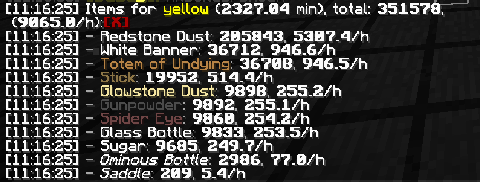

# 图腾农场开发笔记

## 参与人员

- Youmiel

协助：

- Menggui233
- Qian_Ye_

## 开发动机

1.21 目前还没有适配的袭击塔，尽管女巫掉落物（红石、萤石粉等）可以依靠女巫塔，绿宝石可以靠村民交易，但是图腾没有来源。并且研发图腾农场可以作为袭击塔的技术储备，故设立此项目。

## 构思（2024-07-08）

这个设计不考虑自循环不详之瓶，是建立在有充足不详之瓶储备的前提下的。整个塔需要经历的流程是：玩家使用不详之瓶 - 检测玩家使用不详之瓶 - 等待30s - 迁移袭击 - 传送所有怪物到地狱 - 怪物处死 - 收集。

因为真实客户端和服务端之间存在网络延迟，给予玩家不详之瓶之后需要主动检测不详之瓶消耗才能够确定袭击触发的时刻。检测方式为玩家副手拿一组不详之瓶，旁边使用不详之瓶物品和压力板检测玩家是否拾取物品。

30s等待可以直接使用瓶子农场中长时间计时器的思路制作计时器，重置端可以用来解决 30s 内多次使用不详之瓶的问题。袭击迁移链可以直接使用 40gt 袭击塔中的单村民迁移链。

因为不死图腾不需要玩家击杀就能获取，那么可以直接将所有怪物传送到地狱摔死。1.21 允许乘客和载具跨维度传送，只需要在生成平台修建地狱门即可。
 
乘客可以在载具上受到摔落伤害，可以在不摔死劫掠兽的前提下直接摔死骑士，缩短摔落管道的长度，后续想办法分离劫掠兽即可。

## 开发日志（2024-07-09）

### 生成平台

生成平台使用两列共计10格生成位置，使用船将怪物推进地狱门。

### 处死管道

劫掠兽有100血，摔死需要100格以上的距离，地狱端处理显然接受不了过高的管道，一是存活时间太长，二是为了一个怪物处死去破基岩不太值得。

摔落结构参考了史莱姆农场中用间隔放置的活板门分离大小史莱姆的设计。上方另加一层更稀疏的活板门来推走存活的劫掠兽。

### 控制玩家使用不详之瓶的方式

玩家按下使用键时，会优先与方块交互/与实体交互，最后才是使用手中的物品。因此可以在玩家面前放置音符盒、压住的箱子、盔甲架等阻挡使用动作发生。

## 开发日志（2024-07-10）

### 处死室改进

测试处死室的时候发现有骑士的劫掠兽无法被其他实体推动，遂修改了地狱端弹出实体的设计。增加了一组船和活塞，船用于推出普通袭击怪，活塞用于拉走有骑士的劫掠兽。

### 计时器

利用压力板的下降沿信号来确定玩家何时使用了不详之瓶，测重压力板的检测间隔是 10gt，假设中间延迟600gt，则最乐观的情况是玩家使用不详之瓶后 601gt 就迁移袭击，最悲观的情况是玩家使用不详之瓶后 610gt 才迁移袭击。扣除玩家使用物品所需的32gt，剩下 568gt 需要延时器处理，电路直接借用不详之瓶农场中的40分钟计时器。

分解因数后发现，568gt 附近 572、567、560 gt 比较适合作为长计时器的参数，分别是：572 = 4 * 11 * 13， 567 = 9 * 9 * 7， 560 = 8 * 5 * 14 = 7 * 8 * 10。最后实际使用的参数是 40 * 14 = 560，剩余40gt的余量留给玩家使用物品和电路延迟。

控制器部分时序如下：检测到玩家拾取不详之瓶 - (重置定时器 - 投出新的瓶子 - 检测瓶子是否被玩家拾取，若有，则循环) - 定时器计时完成 - 反复遮挡玩家和音符盒的连线使其开始使用下一瓶 - 计时满 600gt 后迁移袭击。

###  控制玩家使用不详之瓶的方式（补充）

假人的长按使用无法被盔甲架阻挡，改成音符盒才行。

2024-07-28 补充：最开始我以为是假人会无视盔甲架与后方方块直接交互，事实上是假人与盔甲架交互失败时会继续处理“使用手中物品”的逻辑，而不像原版一样直接跳过。

## 开发日志（2024-07-11）

### 物品收集

测试得，农场的效率如下：

有价值的产物是红石粉、火药、萤石粉和不死图腾。使用大吸力分类打包前三者，不死图腾和鞍通过不可堆叠分离器之后直接打包，模块依然是现成的。

另外，产物中不详之瓶的效率是 77/h，袭击触发速度是 120/h 左右，证明“每波袭击产出不详之瓶的期望是 2/3”这个结论是正确的。

 
 
 
 

图腾农场开发笔记 © 2024 作者: Youmiel 采用 CC BY-NC-SA 4.0 许可。如需查看该许可证的副本，请访问 http://creativecommons.org/licenses/by-nc-sa/4.0/。