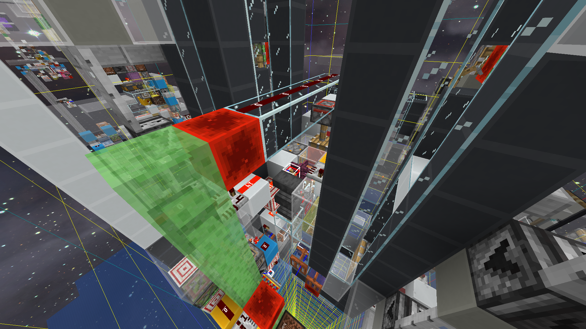
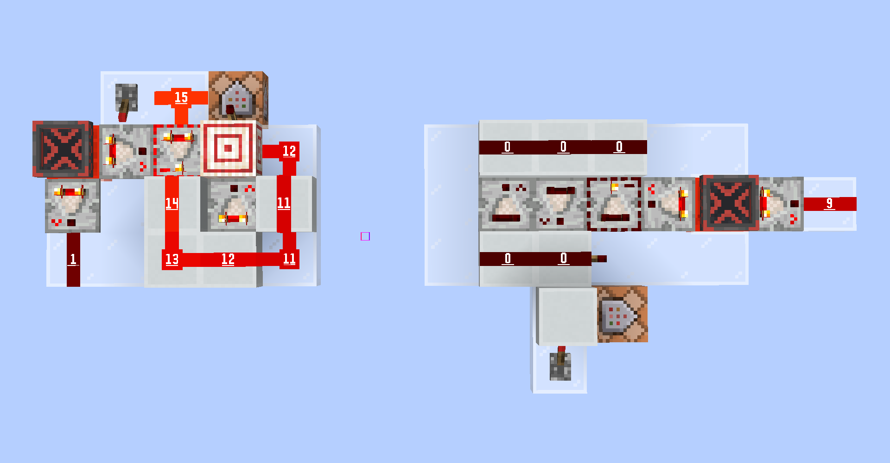
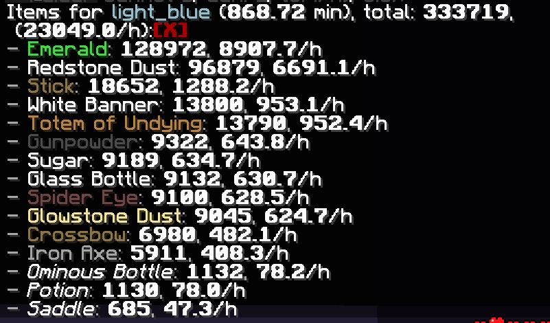

# 1.21 袭击农场开发笔记

## 参与人员

- Youmiel

协助：
- Nickid2018
- sfy_dr
- MizukiYuu

## 开发动机

1.21 改变了袭击的触发方式，从直接触发变成了使用不详药水之后进入村庄触发。这一更改使得以前的袭击塔农场无法继续沿用，故需要重新开发新的农场。

## 构思（2024-07-12）

这个设计不考虑自循环不详之瓶，是建立在有充足不详之瓶储备的前提下的。构想中，农场单个运行周期需要完成以下动作：玩家使用不详之瓶 - 检测玩家使用不详之瓶 - 推动玩家使其在准确时刻触发袭击 - 校准塔的运行周期 - 以20gt周期驱动塔的机械结构 - 等待30s - 迁移袭击 - 等待怪物生成 - 怪物处死 - 收集。

\* 让袭击在准确时刻触发的意义是方便对齐塔内机械部分的运行周期（例如预伤害/归中）

因为玩家附近需要布置检测和触发使用物品的线路，怪物处死布置在玩家下方会更方便，可以使用“安心挂机袭击农场”中的处死室。

### 是否需要避免袭击招募

这取决于是否需要回收不详之瓶，既然现在不需要考虑不详之瓶的回收率，那么袭击招募也可以不用管了。

### 如何兼容真/假玩家

目前来看真玩家和假玩家会有以下不同：

1. 执行动作的游戏阶段不同，目前看来不影响这个农场设计；
2. 真玩家有网络延迟，会影响到攻击、主动移动和使用药水的时刻，设计时应注意；
3. 真玩家右键使用物品可以被盔甲架阻挡，而假玩家会穿过盔甲架点到后面的方块。

### 如何防恼鬼

目前有两种比较可靠的防恼鬼办法：

1. 恼鬼抑制器
2. 在摔伤袭击者后立即利用船将其送入方块中挡住视线，避免女巫投药水

### 如何准确触发袭击

准确触发袭击的技术在之前实验性的“安心挂机袭击农场”中研究过，可以直接用。

## 开发日志（2024-07-15）

### 选择阻挡右键使用的方块

挂机玩家处于两个方块中间，不方便使用铁活板门阻挡右键，需要一种可以被红石控制开关并且没有碰撞体积。目前找到的选择是细雪，可以使用活塞，也可以使用发射器。使用发射器放置细雪无法获知放置细雪的状态，故使用活塞会更优一些。

## 开发日志（2024-07-27）

完成了检测瓶子部分的线路布置，仔细思考之后发现单玩家操作实际上不需要将时钟信号和玩家使用瓶子的信号作与运算，因为 30s 的倒计时时间足够上一波袭击刷完。

### 船吸结构修复

24w03a（1.20.5 快照）修改了“实体的视线处于液体中”的判断高度，现在是视线以上 1/9 方块（credit: Nickid2018），导致原船吸结构无法继续使用。现在这个结构中的船需要下移 1/9 方块才能继续使用，做法是将营火（7像素高）换成大型紫水晶芽（5像素高）。

注：生物在没有着陆位置时下船，脚底位置会在船的碰撞箱上表面中心。因此就算下移了2像素，掉落物（4像素高）仍然可以碰到水道进入收集，但是如果将大型紫水晶芽换成活板门（3像素高），就会有物品因碰不到水流而卡在船上。

## 开发日志（2024-07-28）

### 布线

删除了前一天提及的与逻辑，完成了 30s 计时器和玩家视线阻挡部分。

设计了两个20gt比较器环，用于驱动平台。

### 假人

发现假人与盔甲架交互失败时会继续处理“使用手中物品”的逻辑，而不像原版一样直接跳过，因此无法让假人长按使用键并周期性攻击盔甲架来挂机这个袭击塔。

## 开发日志（2024-07-29）

### 幽灵物品

玩家背包装满并且手中持有一组食物，食用食物的同时捡起地面的相同物品会发生客户端-服务端不同步的问题。客户端中玩家的物品数量减少后不会因为拾取物品而增加。这个问题导致袭击塔的瓶子补充无法使用。

没有很好的办法更新玩家手中的物品数量，遂弃用目前的检测式思路，重构成时钟式。

### 重构后的流程

设计为用 608gt 的时钟驱动的袭击塔，因为 608gt = 8 * 76gt，仍然用比较器时钟加计数器制作长时钟。

启动时：开启开关 - 重置时钟 - 延时启动（用于准备工作）- 校准刷怪平台

每周期（每 76gt 划分一个阶段，正好可以通过锁存器中的信号等级来处理）：

1. 玩家开始使用不详之瓶；
2. 推动玩家进入村庄区段，补充不详之瓶，上一周期的袭击生成，启动迁移链；
3. --
4. --
5. --
6. --
7. --
8. --

## 开发日志（2024-07-29）

### 重构布线

完成了重构，接下来测试效率和稳定性。

因为这个袭击塔需要原版表现的客户端才能正确运行，遂邀请了一位朋友（sfy_dr）来挂机袭击塔。

## 开发日志（2024-09-08）

### 修改时钟

当袭击塔以 20gt 周期驱动时稳定性欠佳，长时间挂机总会刷出恼鬼，遂改为 40gt 周期。比较器时钟设计来自 MizukiYuu：

想最大化效率，所以还是选择了 602gt 的袭击生成时钟。

### 效率

使用真实客户端测试了 800 多分钟，效率和稳定性都得到了充分测试。

 
 
 
 

1.21 袭击农场开发笔记 © 2024 作者: Youmiel 采用 CC BY-NC-SA 4.0 许可。如需查看该许可证的副本，请访问 http://creativecommons.org/licenses/by-nc-sa/4.0/。