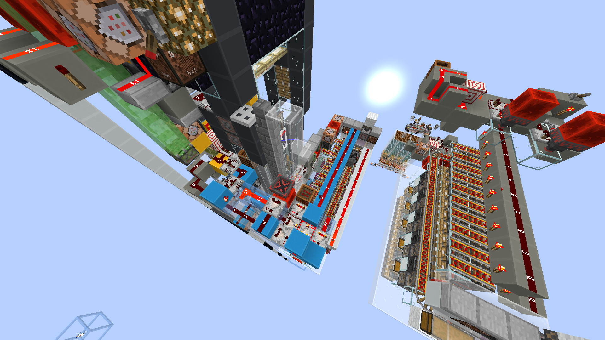

# 1.21 多人挂机袭击农场开发笔记

## 参与人员

- Youmiel

## 开发动机

在 1.21 单人挂机的袭击农场整体完成后，我希望尝试一下能否将多人轮喝药挂机融合进现有的电路中，这样可以提升修建一座塔的资源回报。

## 构思（2024-08-10）

在单人挂机的袭击塔中已经实现让玩家先喝药，等待足够时间后再移动玩家以准确触发袭击的逻辑，只要对现有结构加以拓展，应该就能增加提供不祥之兆玩家的数量，只要将这些玩家的挂机位置整合成一个模块即可方便地实现单人/多人挂机切换。

### 难点：运行周期

实测得知，单人挂机连续生成袭击的最短周期是 601gt 而非 600gt，这个数字不是 20gt 的整数倍，多次循环以后袭击塔与袭击刷怪间隔之间会发生“相位偏移”的现象，导致袭击在生成平台被遮挡时尝试刷出怪物，进而降低效率。

或许应该采用 610gt 或者 620gt 的运行周期以更好地对齐袭击刷怪间隔。

对 610gt 和 620gt 进行分解质因数可得：
- 610gt = 2 * 5 * 61 gt
- 620gt = 2 * 2 * 5 * 31 gt = 10 * 62 gt

显然，对于比较器环 + 计数器的组合，620gt 更好做。

## 开发日志（2024-08-11）

### 不祥之兆发生模块设计

将玩家聚在一起容易出现的问题是互相抢物品，所以这个设计必须在保证紧凑的同时又让投掷器之间有一点距离。使用细雪减速投掷器投出的物品

## 开发日志（2024-08-13）

将不祥之兆发生模块接入袭击塔，驱动信号直接引自驱动刷怪平台的时钟。受限一个区块的宽度，只加了 11 个挂机位置，实际上加更多也不是问题。

## 开发日志 (2024-09-09)

### 效率

分为 11 玩家挂机和 11 + 1 玩家挂机的效率，即处死室中的玩家是否挂机的区别。

 
 
 
 

1.21 多人挂机袭击农场开发笔记 © 2024 作者: Youmiel 采用 CC BY-NC-SA 4.0 许可。如需查看该许可证的副本，请访问 http://creativecommons.org/licenses/by-nc-sa/4.0/。