# 1.21 自循环袭击农场开发笔记

## 参与人员

- Youmiel

协助：
- acaciachan
- Hydrogen_PDC

## 开发动机

在 1.21 大改袭击触发机制后，常规袭击塔的不详之瓶回收率成为了问题。根据 [研究笔记](../../articles/2024-06__1-21_raid/mechanic_note.md)，如果直接处死袭击怪，会出现不详之瓶入不敷出的状况。本设计尝试利用队长替换的机制，将卫道士队长替换成掠夺者队长。

## 构思（2024-09-18）

捕捉队长的结构可以参考：
[【MC】堆叠不祥之兆储存【Ajvej & Bread】](https://www.bilibili.com/video/BV1ve4y1Q7LT)，捕捉前 3 只怪大概率可以把卫道士捉干净。

理想方案是在袭击中心 96 格内完成队长捕捉以及击杀（使用TNT），由于 MC-247440，不能在队长还未死亡的时候就将其移出袭击，否则队长替换就无法继续。随后设法让剩余的掠夺者拾取到旗帜变成队长，再进行击杀即可掉落不详之瓶。可以利用摔落通道的高差来移出袭击怪，这样需要将袭击中心上移而非传统的下移。

目前来看 1.21.2 即将更新的内容会修改袭击队伍生成点的高度差到 96 格内，修改袭击怪的刷新方式，且修复 MC-247440，那么本塔应该在设计时尽量兼容 1.21.2.

## 开发日志（2024-09-18）

完成向上迁移链的设计，完成刷怪平台布置。

需要在下一波袭击生成前快速杀死队长，目前想到的办法是用矿车将怪物运至 TNT 复制器旁边炸死，同时回收矿车。因为刷出的本波怪物距离袭击中心小于 96 格，直到怪物通过下落通道前，下一波怪不会生成。

TNT 处死队长部分需要使用海泡菜或者蜡烛才能达到足够秒杀的爆炸伤害。

## 开发日志（2024-09-19）

### 物品收集

物品收集处使用脸对脸侦测器，以节省布线空间以及错位后自行恢复。这是从 TIS 双维度史莱姆处死中习得。

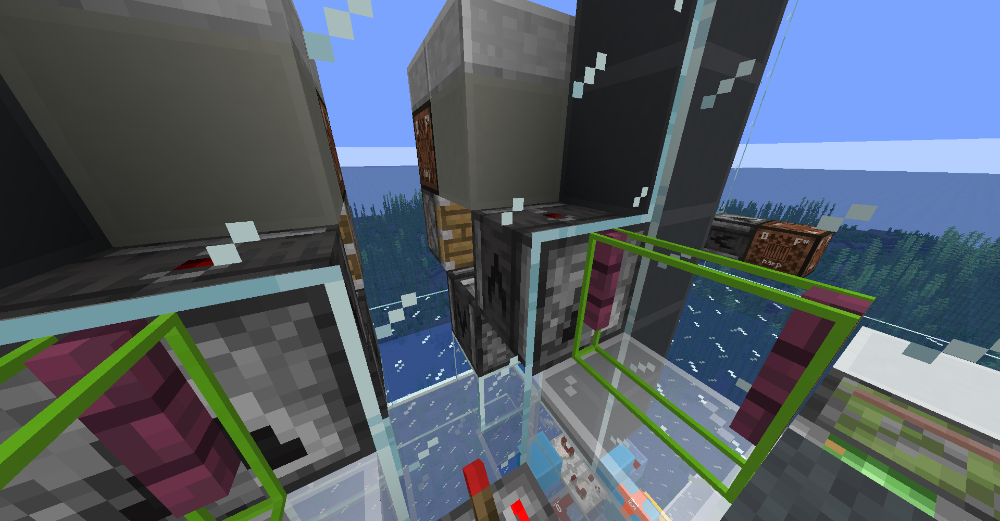

### 袭击触发

这次使用的迁移链将袭击向上迁移，袭击触发其需要从“将玩家向下推动”改成“将玩家向上推动”。布线简单很多，因为不需要考虑玩家头上的方块影响玩家姿态，并且还有重力帮忙。

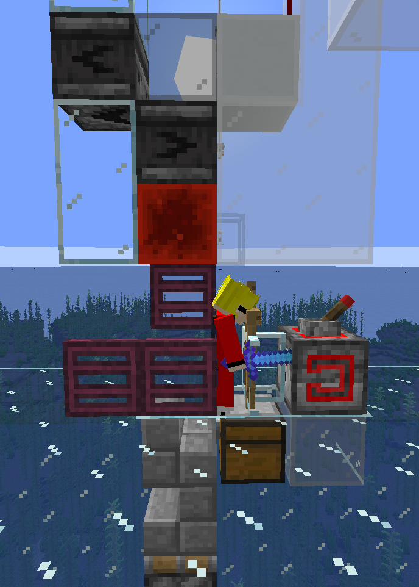

### 布线颜色

飞线实在太多，为了防止以后修改的时候看不懂线路，现在使用四种不同颜色的方块布线，分别是白色、浅灰色、黄色、浅蓝色。

### 计时器和基本控制流程

计时器和控制流程使用 [1.21 袭击农场开发笔记](./raid_farm_dev_note.md) 中开发的 602gt 计时器及控制流程。

## 开发日志（2024-09-20）

### 问题1：无法拾起旗帜

已经满足袭击怪拾取旗帜的条件，但是它们似乎无法捡到。

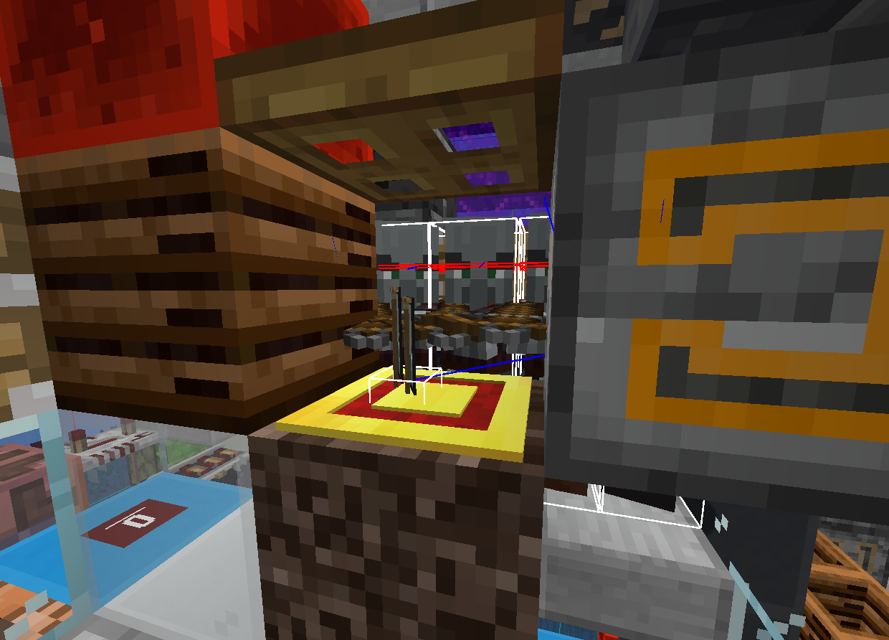

原因分析：
1. 比较掉落物和袭击怪能拾取物品时，代码中使用了`ItemStack.matches()`，会比较物品数量。因此不等于 1 的旗帜堆叠数都不能被袭击怪捡起。
2. 掉落物需要处于袭击怪能寻路到的位置，具体机制暂不清楚。

### 生成平台改进

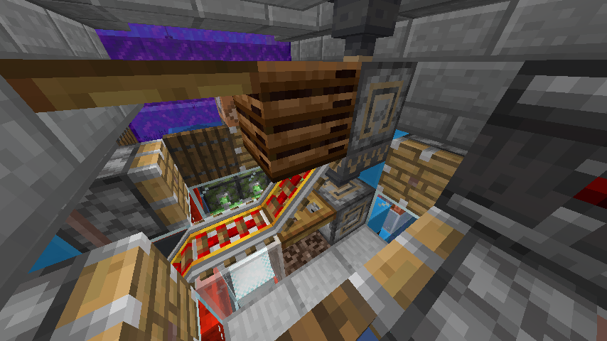

存在把劫掠兽接走的问题。

## 开发日志（2024-09-21）

### 生成平台修改.1

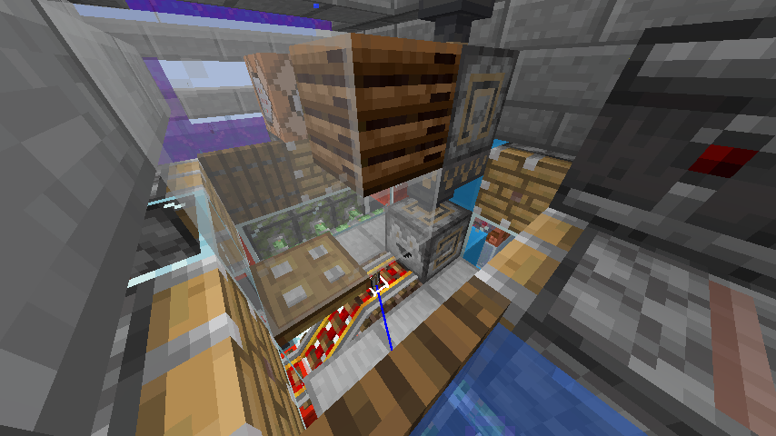

存在第二波矿车把新队长接走的问题。

### 粉雪缓冲

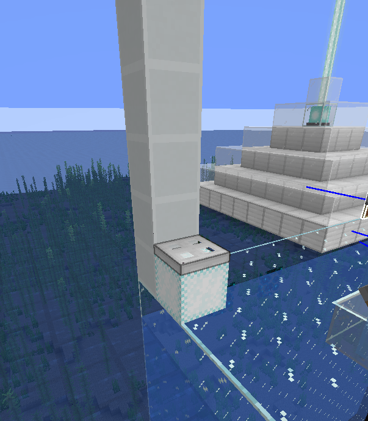

粉雪上叠加小于 0.2 格厚度的方块仍然可以使粉雪的缓冲生效。处死室中部分怪物因此没有掉血，故经常观察到不能一击必杀的现象。

### 生成平台修改.2

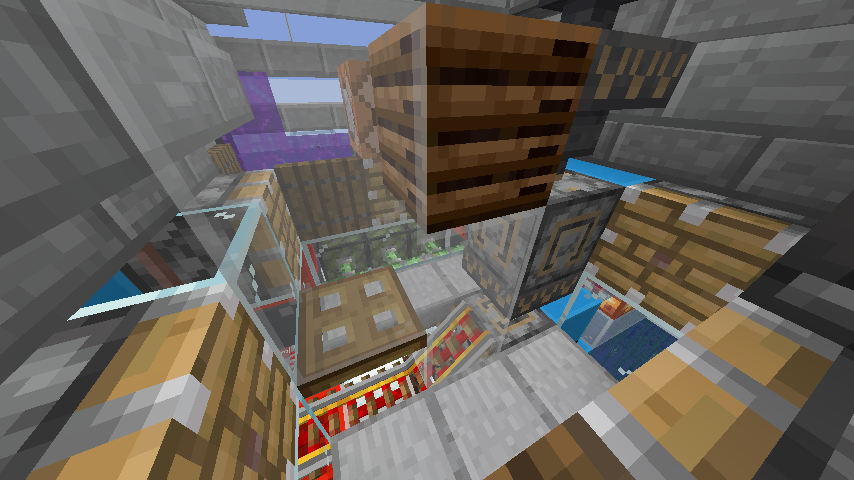

改来改去最后还是变回了 Ajvej 的生成平台，只是把之前的旗帜重投移到了铁轨上。

### 调整时序

将刷怪平台的运行周期改为30gt。调整了很多地方的时序，数目太多我记不清了。

## 开发日志（2024-09-22）

### 稳定性测试

目前发现抓队长的矿车会随着时间推移消耗光，猜测是因为不死图腾进入循环系统导致发车发出一辆车，导致车还没进入爆炸室就被炸掉。

### 时序优化

电路中设计有时钟对齐逻辑，每 602gt 将驱动刷怪平台的 60gt 时钟重置一次，以适应每次偏移 2gt 的袭击生成相位。最开始的时序是大致估计的，经常出现袭击刷怪因为平台被阻挡而失败的情况；重新调整后的时序将袭击首次刷怪时刻定在了刷怪平台每周期第一次动作前6gt，刷怪成功率大大增加（85% -> 95%）。

## 开发日志（2024-09-23）

### 矿车分离

将矿车回收处的不可堆叠物品分离换成了矿车分离，这样就不会被混入的不死图腾影响。

### 恼鬼抑制器

这次的塔身非常窄，放不下船吸结构，恼鬼的问题不好解决，在各种尝试（预伤害、调整时序、使用蓝羊变红AI）之后，还是换成了恼鬼抑制器。

## 开发日志（2024-10-06）

### 理论效率

真人挂机可能掉线，不方便测效率，这是用假人挂机并在电路中插入命令方块给予不祥之兆效果测试得到的理论值：

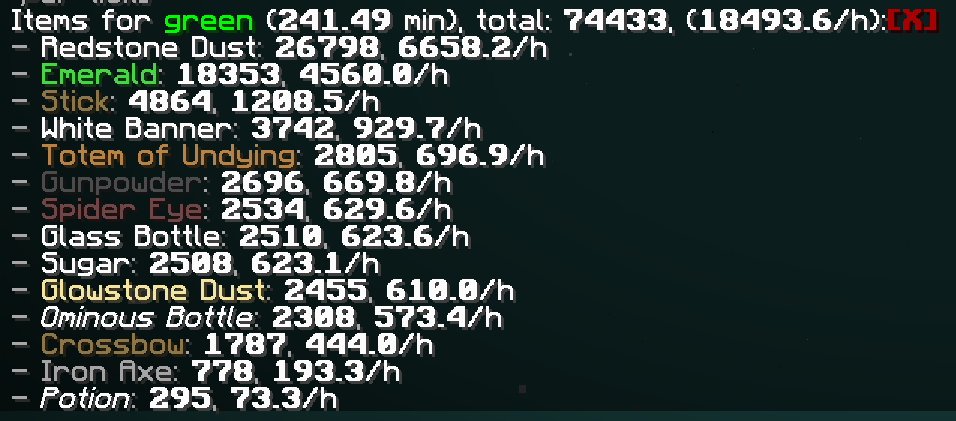

### 收集 - 常规物品

常规物品打包使用的是 pyra 的设计，顶部的大吸力物品分类被我修改成了更整齐一点的设计。

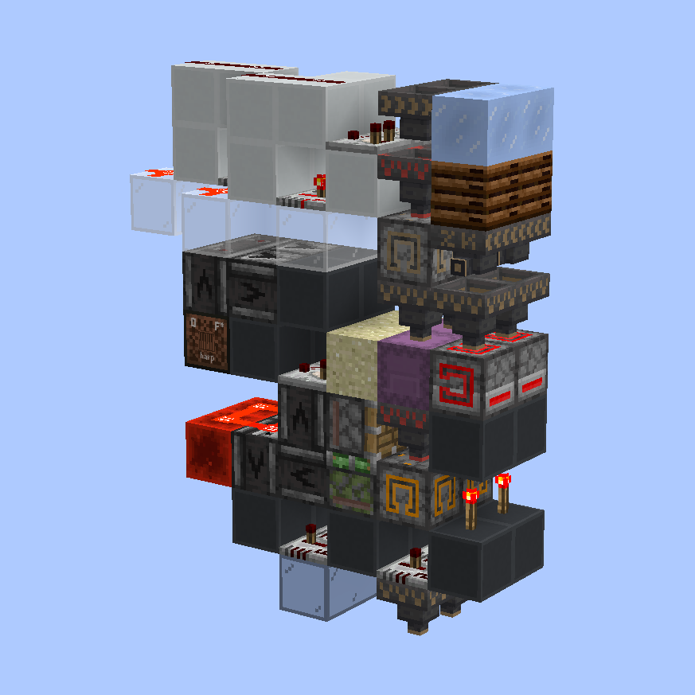

### 收集 - 图腾分类

图腾分类由多个组件拼成：可堆叠/不可堆叠分离、铁斧/弩筛除器、药水分离、打包机。铁斧/弩筛除器使用的设计来自 acaciachan(金合欢酱) 和 commandLeo，其余部分比较简单，是现场设计的。

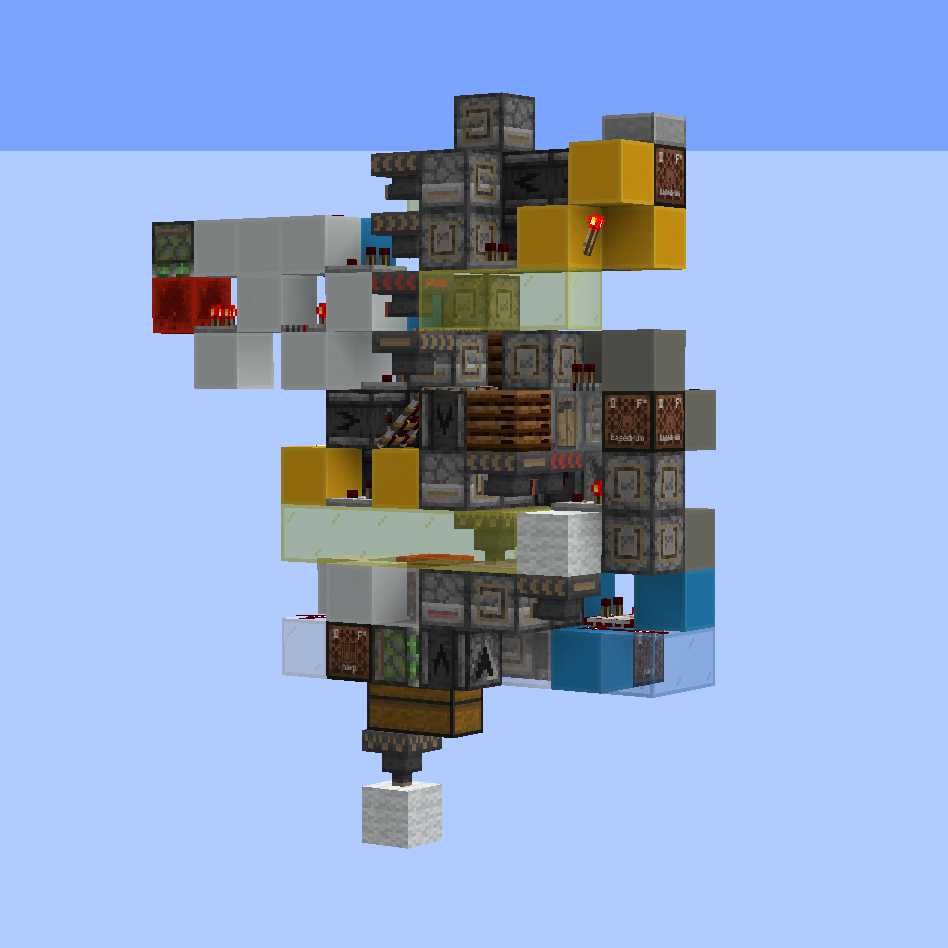

### 收集 - 空盒补充

空盒补充使用的是 Mangelious, 萌萌的小公举, viomm 和 acaciachan(金合欢酱)共同的设计，因为盒子需求不大所以单独截取了底座部分。

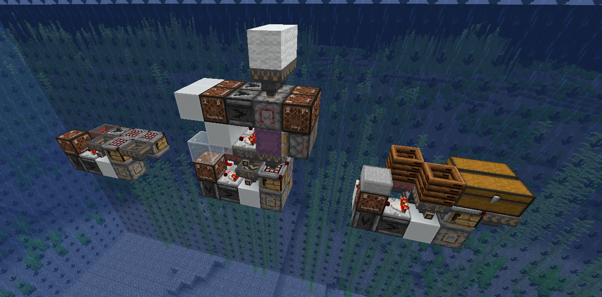

### 收集 - 经验分离

物品收集的水道中偶尔会落入经验球，将它们单独分离出来或许有用。控制好物品速度就可让物品越过水道中的空隙而让经验通过空隙落出水道。

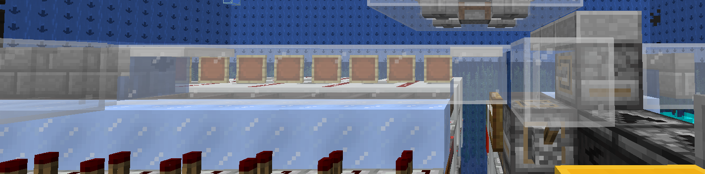

## 开发日志（2024-10-08）

### 收集 - 单倍大吸力分类-九合一-打包-AB单片

红石粉和绿宝石两者虽然只有不到单倍速漏斗的效率，但是不合成块就直接打包还是很占空间，于是我抽空做了如图所示的 AB 单片收集来解决这一需求。大吸力分类和打包机还是从之前的收集系统里继承过来的，九合一合成部分使用的是混杂打包的检测思路。

左边的设计被验证为极其不稳定，不应该被使用。

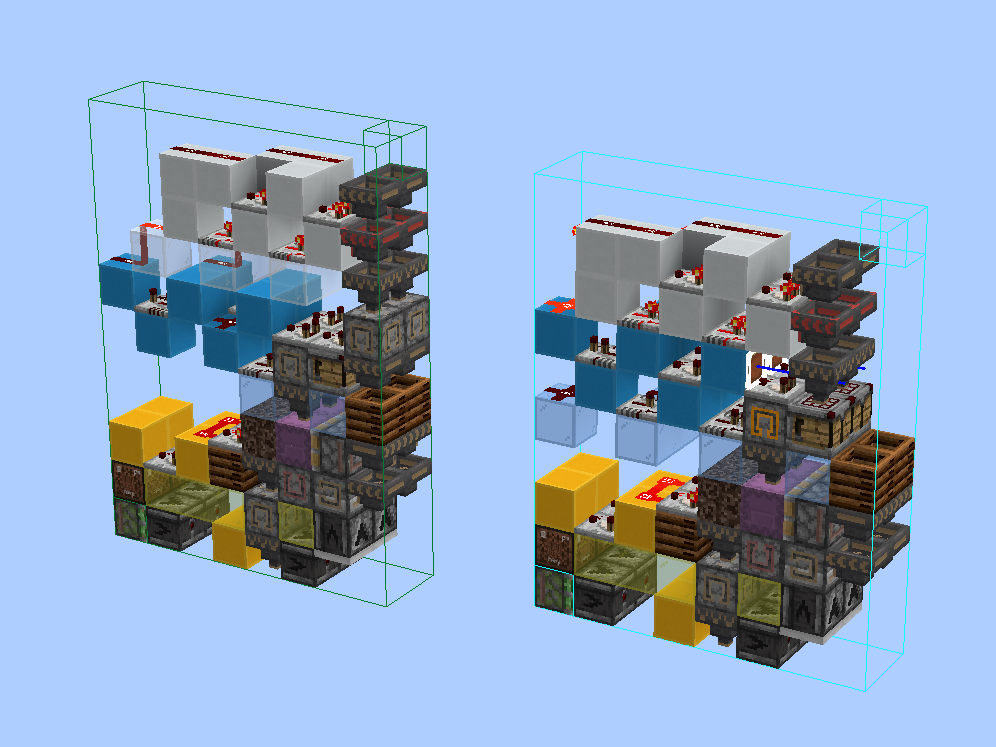

## 开发日志（2024-11-19）

### 收集 - 瓶子分类

收集系统中使用了 5 个分类单片来收集 5 种不同的不详之瓶，我认为这非常浪费空间。我在求助之后，得到了这个由 acaciachan 设计的 5 分类矿车分类器，占用水道 2 宽，搭配慢速水道使用效果更佳。

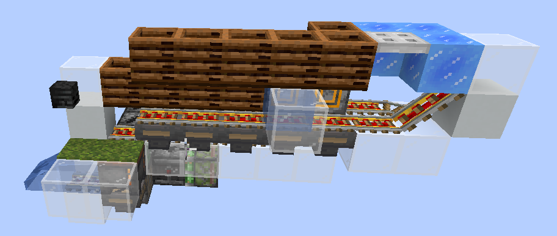

如此替换之后，原本占用 5 格宽加额外防串线的空间的瓶子收集，可以改成 4 + 1 的形式（2~5 级为一组，1 级单独分类），减小了 3~4 格宽度。由于这个矿车多物品分类结构非常简单，它甚至可以夹在不同收集单片之间，利用上原本为隔离信号保留的空间。

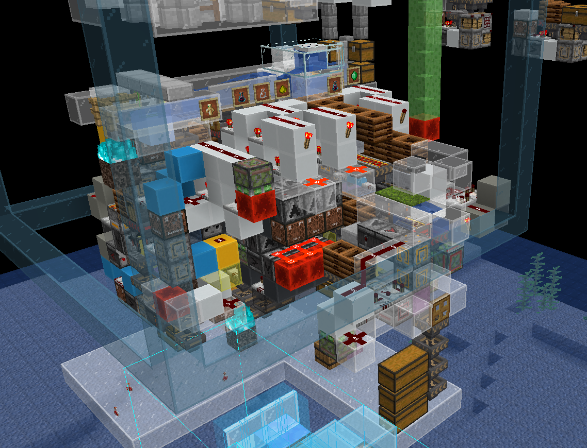

## 开发日志（2024-12-05）

### 1.21.2+ 兼容性

经测试，这个塔不具备 1.21.2+ 的兼容性，主要问题还是 1.21.2+ 大幅更改的袭击者刷新逻辑，并且 1.21.2+ 对于拾取旗帜的逻辑有更新，最好还是重新设计。

### 1.21.2 可能的改进

1. 需要适配新的刷新机制
2. 队长移出袭击之后（非死亡），其他队员可以正常捡起旗帜，所以队长替换可以做得更高效，不详之瓶农场也可以据此改进

## 开发日志（2024-12-10）

### 瓶子分类 bug 修复

测试运行的时候发现，[瓶子分类](#收集---瓶子分类)中使用的设计在单人档不能正常运行，一番测试之后发现这个设计在某些特定坐标无法正常运行。

经过原作者 acaciachan 调试后发现，某些时刻，漏斗矿车碰撞箱的一个面正好与方块网格的面重合。由于浮点数精度问题，漏斗选择实体的选取框在某些坐标不能选中这样的矿车，而另一些坐标又能选中，所以吸取范围内有时会包含两个漏斗矿车。众所周知，当漏斗试图从多个容器矿车中取物时，会随机选择一个矿车后检查内容物，如果选中空矿车而不是需要取物的矿车，那么就会漏掉一个物品。

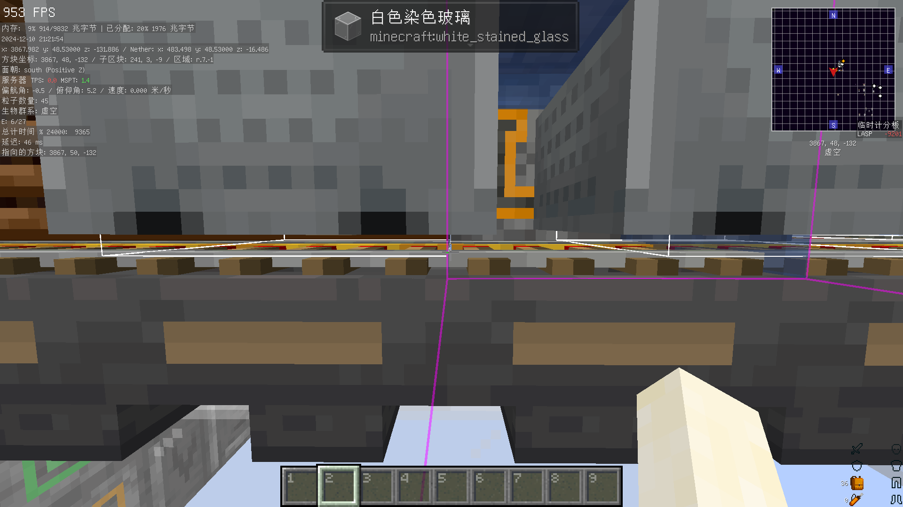

修复方法是设法调整漏斗矿车的位置，避免它的碰撞箱与方块网格刚好重合，acaciachan 给出的修复方式是将斜充能铁轨上方的方块换成含水活板门。

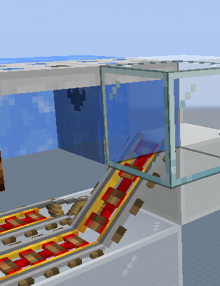

 
 
 
 

1.21 自循环袭击农场开发笔记 © 2024 作者: Youmiel 采用 CC BY-NC-SA 4.0 许可。如需查看该许可证的副本，请访问 http://creativecommons.org/licenses/by-nc-sa/4.0/。