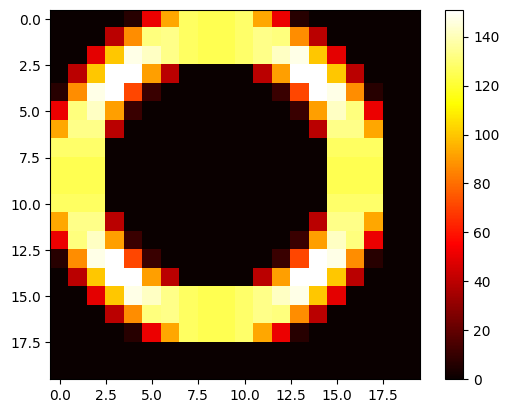

# 1.21.2 袭击农场开发笔记

## 参与人员

- Youmiel

## 开发动机

1.21.2 改变了袭击怪物的生成方式，从原本的 64、32 半径的圆环加中间 5*5 改成了半径随袭击生成倒计时减小的圆环，并且倒计时为 0 的时候尝试生成的位置也不处于袭击中心。另外，生成位置还有与袭击中心高度差的限制。所以原本的生成平台设计不再适合 1.21.2 以上的版本。

## 机制研究

### 测定生成范围（2024-12-27）

虽然[研究笔记](../../articles/2024-06__1-21_raid/mechanic_note.md)中已经大概得知 `t=0` 时生成范围的形状（一定半径的圆周 xz 方向分别平移 1~2 格叠加而成），但是确切的样子还不得而知。为了准确地确定生成范围，我做了如下的试验：

1. 准备一块足够大的白色混凝土平台，这里使用的是 48 * 48 大小
2. 在平台的中心点上方 80 格处放置一个村民 poi
3. 在该 poi 附近挂机一名玩家，每 900gt 通过命令给予不祥之兆
4. 在平台底部中心附近放置命令方块链，将附近128格内生成的袭击者脚下的白色混凝土换成黄色混凝土，并将它们传送出袭击范围：<br>
```
execute as @e[distance=..128, type=#raiders] at @s run tag @s add raid_marker
execute as @e[tag=raid_marker] at @s if block ~ ~-1 ~ minecraft:white_concrete run setblock ~ ~-1 ~ minecraft:yellow_concrete
execute as @e[tag=raid_marker] at @s if block ~ ~-2 ~ minecraft:white_concrete run setblock ~ ~-2 ~ minecraft:yellow_concrete
execute as @e[tag=raid_marker] at @s run tp ~ ~-2 ~
```
5. tick warp 加速运行足够时间，观察混凝土平台上的图案。

实验场景如图：


测得的生成范围，其中灰色混凝土为袭击中心；红色混凝土为 x 轴正方向；蓝色混凝土为 z 轴正方向；黄色部分为除了第一波以外的其他波次生成范围。第一波因为必然有倒计时，生成位置在平台边缘，不在图中：


可以发现，新的袭击生成范围和旧的相比只有 10 个方块有重叠。


### 计算生成概率（2024-12-28）

圆周形的生成范围映射到方形网格上，每个格子的生成概率并不平均，并且，我们要研究的生成范围由 9 个圆周叠加而成。我们需要计算出每一格上的生成概率才能更好地设计袭击塔生成平台。

计算概率的方法是在圆周上每 0.001pi 取一个点，统计每格中点的数量，最终绘制出单个圈的热力图如下：


将九个圈叠起来后的图像如下，对比前文测得的形状可以发现两者一致：



生成热力图的代码见：[1-21-2_raid_spawn/sample.ipynb](./1-21-2_raid_spawn/sample.ipynb)

所以，如果要计算某个生成平台设计的最终生成概率，计算方法是先通过平台覆盖位置的概率之和 `x`，然后计算 `1 - (1-x)^120` 得到最终生成概率（通过[研究笔记](../../articles/2024-06__1-21_raid/mechanic_note.md)可知，袭击刷新倒计时至 0 的时候会尝试寻找生成位置 120 次）。理论上来说只需要覆盖单次生成尝试中总概率为 4% 的范围就可以让最终生成成功率达到 99% 